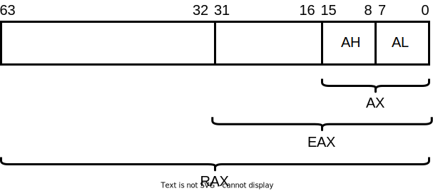

# Introduction

In the previous 2 sessions you started discovering what binary security looks like.
[Last session](../binary-analysis/) you learnt two very powerful means of investigating and even reverse engineering executables: static and dynamic analysis.
In order to leverage them efficiently, you used Ghidra for static analysis.
Now we'll introduce GDB for dynamic analysis.
You've most likely noticed that they are able to display the source code of the application.
GDB can do so when said app was compiled with _debug symbols_, while Ghidra does not even need debug symbols.
It infers the original C code from its compiled representation (learn more about how Ghidra does this by taking part in the [Binary Security track](https://security-summer-school.github.io/binary/static-analysis/#ida-and-ghidra) next year).
This representation is called **assembly language**.
Both Ghidra and GDB can display the program's code in assembly language.
Today we will demystify this low-level language and learn to understand it.

# Reminders and Prerequisites

For this session, you need:
- a working knowledge of the C programming language and familiarity with pointers
- basic skills with Ghidra and GDB
- understand how an executable file is created, as described in the [Application Lifetime session](../application-lifetime/)
- knowledge of the following means of representing data: ASCII, binary, hexadecimal.
Check out the session on [Data Representation](../data-representation/) for a reminder.

# Assembly

Assembly is a low-level language used as a human-readable representation of instructions executed by the CPU.
There is a one-to-one mapping between the binary code executed by the CPU and Assembly.
Few people write Assembly, but many people are required to read it:
- security engineers
- compiler / interpreter developers
- embedded developers
- operating systems developers

Simply put, if a field is close to CPU it requires (some knowledge of) Assembly.
So let's learn this language!

# Registers

You might have already seen the image below.
It shows the various places where data can be kept.
Note that this data can be both non-persistent and persistent.
Non-persistent data is gone once you shut down the computer.
It's kept in all levels from "Main Memory" upwards.
The "Main Memory" is simply referred to as **memory** or RAM.

Persistent storage refers to data on **disks**: HDD, SSD, CDs, DVDs, magnetic tapes, even in the cloud (where cloud storage providers also use HDDs, SSDs etc.).
If you shut down your laptop or your mobile phone, your pictures or video games remain unchanged.
This is because they are stored **on your device's disk**.
We simply refer to persistent storage as **storage**.
Take note of the difference between _storage_ and _memory_.


In most programming languages you can freely access data everywhere up to and including the memory.
In assembly however, you also have access to the **registers** and can influence the _cache_.
We won't be dealing with the cache in this session, but you can read more about them [at the end of this session](#caches)
They are the fastest form of memory available and are implemented *inside the CPU*.
We can access data in registers in less than 1 ns (nanoseconds), as opposed to a few dozen ns when fetching data from the RAM.

Then why not make more registers and only use them instead of RAM?
Registers are fast because they are few in number.
This allows them to be efficiently wired to the CPU's Arithmetic and Logic Unit (ALU), which is responsible for executing basic operations, sch as addition, subtraction, bitwise and, or, shifts etc.
The more registers, the more complex and the less efficient the logic.

## Registers in an X64 CPU

Registers are like variables with fixed names embedded in the CPU.
They can be assigned values that can be modified via instructions.
There are several types of registers inside a CPU.
All of them can be assigned data and that data can be modified using the assembly-level operations described [further in this session](#assembly-instructions).

All registers are **64-bits** wide.
So they each can store up to 8 bytes of data.

### `rip`

We'll start with a very special and illusive one: the **instruction pointer** - `rip`.
In [the previous session](../binary-analysis/), you learned that the code of any process is also in its memory.
In order to read and execute it, the CPU must "follow" it just like children follow text with their fingers.
The CPU does this using `rip`.
This register stores te **address of the currently executed instruction**.
We will never use this instruction per-se in instructions, but you will see and make use of it in GDB.

### General Purpose Registers

Then there are **general purpose registers**.
As their name implies, they are used to store _anything_: addresses, user input, function parameters, data read from files or from the web etc.
Some of them also have some special functions, especially regarding function calls:
- `rax`: accumulator register
- `rbx`: base register
- `rcx`: counter register; used with the [`loop`](#loop) instruction
- `rdx`: data register
- `rdi`: destination register
- `Rsi`: source register
- `r8`, `r9` ... `r15`: regular registers

Do not learn them by heart.
And also do not bother with their extra meanings.
We will make use of those only when specified.
Otherwise, treat them as simple variables.

### Smaller Registers

Sometimes you only need to access 32 or 16 or 8 bits out of a 64-bit register.
This is possible by slightly changing the name of the register like so:

| 64 bits | Lowe 32 bits | Lower 16 bits | High 8 bits  | Low 8 bits |
|:-------:|:------------:|:-------------:|:------------:|:----------:|
| `rax`   | `eax`        | `ax`          | `ah`         | `al`       |
| `rdi`   | `edi`        | `di`          | unaccessible | `dil`      |
| `r8`    | `r8d`        | `r8w`         | unaccessible | `r8l`      |

The bits contained in each of the above subdivisions are shown in the image below.
It is similar for `rdi` and `r8`, it's just the names that differ.



`rbx`, `rcx` and `rdx` have the same subdivisions as `rax`.
`rsi` has the same subdivision as `rdi`: `esi`, `si` and `sil`.
It doesn't make sense to access 4 bytes of an address.
The lower 2 bytes can be accessed due to historical reasons.
In the 70s, when the first CPU of this family (8086) was launched, it only supported 2-byte addresses.
All registers `r9` to `r15` have the same subdivisions as `r8`.

# Assembly Instructions

We've now learned what assembly is theoretically and what registers are, but how do we use them?
Each CPU exposes an **ISA (Instruction Set Architecture)**: a set of instructions with which to modify and interact with its registers and with the RAM.
There are over 1000 instructions in the x64 ISA.
There are even instructions for efficiently encrypting data.
Find out more about them by enrolling in the [Hardware Assisted Security track](https://github.com/security-summer-school/hardware-sec/).

Before we dive into the instructions themselves, it's useful to first look at their generic syntax:
```
instruction_name destination, source
```

Most Assembly instructions have 2 operands: a source and a destination.
For some operations, such as arithmetic, the destination is also an operand.
The result of each instruction always stored in the destination. 

Below we'll list some fundamental instructions.
We will be using the Intel Assembly syntax.    

## `mov`

`mov` is the most basic instruction in Assembly.
It _copies_ (or _moves_) data from the source to the destination.
Also note that comments in Assembly are preceded by `;` and that the language is case-insensitive.
```asm
mov eax, 3              ; eax = 3

mov rbx, "SSS Rulz"     ; place the string "SSS Rulz" in `rbx`
; This places each byte of the string "SSS Rulz" in rbx.

mov r8b, bh              ; r8b = bh
; The sizes of the operands must be equal (1 byte each in this case).
```

## Data Manipulation

Now that we've learnt how to place data in registers we need to learn how to do math with it.
As you've seen so far, Assembly instructions are really simple.
Below is a table with the most common and useful arithmetic instructions.
Try to figure out what each example does.
Use the fact that the general anatomy of an instruction is usually `instruction destination, source`.
The result is always stored in the `destination`

| Instruction          | Description     | Examples                          |
|:--------------------:|:---------------:|:---------------------------------:|
| `add <dest>, <src>`  | `dest += src`   | `add rbx, 5`<br>`add r11, 0x99`   |
| `sub <dest>, <src>`  | `dest -= src`   | `sub ecx, 'a'`<br>`sub r9, r8`    |
| `shl <dest>, <bits>` | `dest <<= bits` | `shl rax, 3`<br>`shl rdi, cl`     |
| `shr <dest>, <bits>` | `dest >>= bits` | `shr r15, 5`<br>`shr rsi, cl`     |
| `and <dest> <src>`   | `dest &= src`   | `and al, ah`<br>`and bx, 13`      |
| `or <dest> <src>`    | `dest \|= src`  | `or r10b, cl`<br>`or r14, 0x2000` |
| `xor <dest> <src>`   | `dest ^= src`   | `xor ebx, edx`<br>`xor rcx, 1`    |
| `inc <dest>`         | `dest++`        | `inc rsi`                         |
| `dec <dest>`         | `dest--`        | `dec r10w`                        |

## Control Flow

Now we know how to do maths and move bits around.
This is all good, but we still can't write full programs.
We need a mechanism similar to `if`s from Python and also loops in order to make the code run based on conditions.

### `jmp`

The simplest instruction for control flow is the `jmp` instruction.
It simply loads an address into the `rip` register.
But when Assembly code is generated or written either by the compiler or by us, instructions don't have addresses yet.
These addresses are assigned during the **linking** or **loading** phase, as you know from the [Application Lifetime session](../application-lifetime/).

For this reason, we use **labels** as some sort of anchors.
We `jmp` to them and then the assembler will replace them with relative addresses which are then replaced with full addresses during linking.
The way in which `jmp` and labels function is very simple.
Remember that in the absence of `jmp`s, Assembly code is executed linearly just like a script.

```asm
    jmp skip_next_section

    ; Whatever code is here is never executed.

skip_next_section:
    ; Only the code below this label is executed.
```

> **Warning**
> Do not confuse labels with functions.
> A label does not stop the execution of code when it's reached.
> They are simply ignored by anything except for `jmp`.

For example, kin the the following code, both instructions are executed in the absence of `jmp`s:

```asm
    mov rax, 2
some_label:
    mov rbx, 3
    ; rax = 2; rbx = 3
```

### `eflags`

Each instruction (except for `mov`) changes the **inner state of the CPU**.
In other words, several aspects regarding the result of the instruction are stored in a special register that we cannot access directly, called `eflags`.
There are [instructions](https://stackoverflow.com/questions/1406783/how-to-read-and-write-x86-flags-registers-directly) that can set or clear some flags in `eflags`, but we cannot write something like `mov eflags, 2`.

As its name implies, each bit in `eflags` is a flag that is activated (i.e. set to 1) if a certain condition is true about the result of the last executed instruction.
We won't be using these flags per se with one exception: `ZF` - the **zero flag**.
When active, it means that the result of the last instruction was... 0, duh!
This is useful for testing if numbers are equal for example.
We'll talk about this in the next section. 

### Conditional jumps

Now we know that there is an internal state of the CPU which is modified by each instruction, except for `mov`.
We still need a way to leverage this state.
We can do this via **conditional jumps**.

They are like `jmp` instructions, but the jump is made only when certain conditions are met.
Otherwise, code execution continues from the next instruction.
The general syntax of a conditional jump is
```
j[n]<cond> jabel
```
where the letter `n` is optional and means the jump will be made if the condition is **not** met.

#### `cmp` and `test`

We can use the regular arithmetic instructions that we've learned so far to modify `eflags`.
But this has the drawback of also modifying our data.
It would be great if we had a means to modify `eflags` without changing the data that we evaluate.
We can do this using `cmp` and `test`.

`cmp dest, src` modifies `eflags` as if you were **subtracting** `src` from `dst`, but without modifying `dst`.
This is great for testing if 2 things are equal, or for testing which is greater or lower.

`test dest, src` is similar to `cmp`, but modifies `eflags` according to the `and` instruction.
This comes in handy when we want to check if a register is 0.
```
test rax, rax
jz rax_is_zero
```
is equivalent to
```
cmp rax, 0
jz rax_is_zero
```

Now let's have a look at some conditional jumps:

| Conditional jump           | Meaning                                                       |
|:--------------------------:|:-------------------------------------------------------------:|
| `jz` / `je`                | Jump if the Zero Flag is active                               |
| `jnz` / `jne`              | Jump if the Zero Flag is not active                           |
| `cmp rax, rbx`<br>`j[n]g`  | Jump if `rax` is (not) greater (signed) than `rbx`            |
| `cmp rax, rbx`<br>`j[n]a`  | Jump if `rax` is (not) greater (unsigned) than `rbx`          |
| `cmp rax, rbx`<br>`j[n]ge` | Jump if `rax` is (not) greater (signed) or equal than `rbx`   |
| `cmp rax, rbx`<br>`j[n]ae` | Jump if `rax` is (not) greater (unsigned) or equal than `rbx` |
| `cmp rax, rbx`<br>`j[n]l`  | Jump if `rax` is (not) lower (signed) than `rbx`              |
| `cmp rax, rbx`<br>`j[n]b`  | Jump if `rax` is (not) lower (unsigned) than `rbx`            |
| `cmp rax, rbx`<br>`j[n]le` | Jump if `rax` is (not) lower (signed) or equal than `rbx`     |
| `cmp rax, rbx`<br>`j[n]be` | Jump if `rax` is (not) lower (unsigned) or equal than `rbx`   |

### Loops

We can create loops simply by combining labels and conditional jumps.
For example, `for i in range(0, 10)` from Python is equivalent to:
```asm
    xor rcx, rcx    ; i = rcx; same as mov rcx, 0
for_loop:
    cmp rcx, 10
    je done_loop    ; verify i < 10

    ; The body of the for loop.

    inc rcx         ; rcx++
    jmp for_loop    ; re-evaluate the condition

done_loop:
```

Or alternatively, we can verify `rcx < 10` at the end of the loop:
```asm
    xor rcx, rcx
for_loop:
    ; The body of the for loop.

    inc rcx         ; rcx++
    cmp rcx, 10
    jb for_loop    ; verify i < 10

    ; The code here is executed only after the loop ends.
```

# Dereferencing Addresses

Up to this point we know how to operate with data and can write complex programs using conditional jumps.
But we know that data is stored mostly in the RAM.
How do we fetch it from there to our registers?

Imagine the RAM is one giant array.
Each byte is a cell in this array.
Therefore, each byte is found at a given **index** in this array.
Indices start at 0, so the first byte is found at index 0, the third 3 at index 2 and so on.
These indices are also called **memory addresses**, or simply **addresses**.

In order to load data from the RAM into our registers or vice-versa, we need to specify to CPU which RAM address to access.
This is called **dereferencing that address**.
Syntactically, this is very easy and is done by wrapping the address in `[]`.
The address can be either a raw number, or a register, or an expression:
```
mov rax, [0xdeadbeef]   ; load 8 bytes from the address 0xdeadbeef into rax
mov bx, [0xdeadbeef]    ; load 2 bytes from the address 0xdeadbeef into bx
mov [0xdeadbeef], ecx   ; store 4 bytes from ecx at the address 0xdeadbeef
```

Notice that the number of bytes that are transferred between the RAM and registers is given by the size of the register.
But what happens when we don't use a register?
The code below is incorrect because it is impossible to tell how many bytes to use to write 0x69.
We could write it using one byte of course, but what if we wanted to write it on 4 bytes and store `[ 0x00 | 0x00 | 0x00 | 0x69 ]`?
To eliminate such ambiguities, we must specify the number of bytes that we want to write to the RAM:
```asm
mov [0xdeadbeef], byte 0x2      ; writes 1 byte
mov [0xdeadbeef], word 0x2      ; writes 2 bytes: 0x00 and 0x02
mov [0xdeadbeef], dword 0x2     ; writes 4 bytes
mov [0xdeadbeef], qword 0x2     ; writes 8 bytes
```

Instead of a hardcoded value, we can express addresses as complex expressions which the CPU computes for us.
In the snippet below, the CPU computes the address given by `rdi + rcx * 4` and then writes the contents of `edx` there.
```asm
mov [rdi + rcx * 4], edx
```
This is equivalent to `v[i] = something` where `v` is an array of 4-byte values (hence `rcx * 4`):
- `rdi` = starting address of `v`
- `rcx` = `i`
- `edx` = `something`

Therefore, whenever you see `[...]` in Assembly, what between the square brackets is being dereferenced [**with one exception**](#lea).

## Endianness

This is all nice, but how does all this look like in the memory?
The order in which the bytes are stored in the RAM is called **endianness**.
Most CPUs store bytes **in reverse order**, or **little endian** order, because the least significant byte is the first.
When data is fetched back from the ram, the order is reversed:
```asm
mov [0x100], dword 0x12345678       ; the RAM at 0x100: [ 0x78 | 0x56 | 0x34 | 0x12 ]
mov ax, [0x100]     ; ax = 0x5678
mov bx, [101]       ; bx = 0x3456
```

However, endianness does not apply to strings.
The code below writes the string `SSS Rulz` at the address 0x100.
Notice we don't have to write it in reverse order like `zluR SSS`.
```asm
mov rax, "SSS Rulz"
mov [0x100], rax
; We need to use a register because mov cannot take both an address and a 64-bit immediate as operands.
; https://www.felixcloutier.com/x86/mov
```
# Reading Assembly

## `objdump`

Starting from an executable file, we can read its Assembly code by **disassembling** it.
The standard tool for doing this is `objdump`:
```
root@kali:~$ objdump -M intel -d <binary> | less
```
- Use `-M intel` for Intel syntax.
The default syntax is AT&T.
- `-d` stands for "disassembly".
- pipe the output to `less` so you can navigate the Assembly code more easily.

Notice that every line contains an address, an opcode and an instruction.
The opcode is simply the binary representation of that instruction. 

Alternatively, you can use GDB and Ghidra that you learned about [in the previous session](../binary-analysis/).

## GDB

The undisputed king of Assembly is by far the **GNU DeBugger (GDB)**.
It's just what its name says it is, but its beauty is in its versatility.
GDB is a command-line debugger that allows us to print registers, variables, dump memory from any address, step through the code, go back through the call stack and much more.
Today we will only get a glimpse of its power.

We are using the `pwndbg` extension for GDB as it allows us to view the assembly code, stack (you'll learn about it in the [next session](../taming-the-stack/)) and registers.
Follow the instructions [here](https://github.com/pwndbg/pwndbg#how) to install it if you haven't done so already.

GDB can run Assembly instructions one by one and stops after each instruction.
The current instruction is also clearly displayed.
Below is a reduced list of useful GDB commands to get you going.
Use it as a cheatsheet when you get stuck:

- `start` = start running the program from `main`
- `list` = decompile and display C code
Only works for executables compiled with `-g`
- `pdis` = disassemble and display instructions with nice syntax highlighting
- `next` / `n` = run the current C code
If it is a function call, it is executed without stepping into the function.
- `nexti` / `ni` = run the current Assembly instruction
- `step` / `s` = if the debugger has reached a function call, step into it.
Otherwise, it behaves like `next` / `n`
- `stepi` / `si` = step into function (used for the `call` instruction in Assembly)

- `break` / `b <n>` = place a breakpoint at line `n`
- `break` / `b *<address>` = place breakpoint at address
- `continue` / `c` = run code until next breakpoint
- `info registers <name>` = display the values in all registers.
If a name is specified, only the value in that register is displayed
- `p <variable>` / `<name>` = print the variable / number; similar to `printf`
```
p/d = printf("%d")
p/c = printf("%c")
p/x = printf(“%x”)
p/u = printf(“%u”)
```

- `x <address>` = print data at the address (dereference it).
By default, the output is represented in hex
- `x/<n><d><f> <address>` -> print `n` memory areas of size `d` with format `f`:
```
n = any number; default = 1
d = b (byte - default) / h (half-word = short) / w (word = int) 
f = (like p): x (hex - default)  / c (char) / d (int, decimal) / u (unsigned)  / s (string)
```
Examples:
```
x/20wx = 20 hex words (ints)
x/10hd = 10 decimal half-words (shortsuri)
x/10c = 10 ASCII characters
x/10b = 10 hex bytes (because x is the default)
```

- `set $<register> <value>` = sets the register to that value

# Summary

The key takeaways from this session are:
- Assembly is a human-readable representation of instructions executed by the CPU
- It allows us to access CPU registers directly
- It uses a fixed set of instructions called ISA
- **Memory** is the RAM, **storage** is the disk
- Data is stored in memory using the little endian representation
- You can disassemble a program with `objdump` like so: `objdump -M intel -d <program> |less` 

# Activities

## In Plain Assembly

The flag is almost right there in your face.

## Gotta Link Em All

I wonder what hides in all those object files...

## Jump Maze

Theseus has nothing on you!
Navigate the maze and get the flag.

## Crypto

Is it really about crypto?

## Call Me Little Sunshine

Do what the binary asks you to do.
What, it doesn't work?

# Further Reading

## The Whole ISA

If you want to search for an instruction, use [this](https://www.felixcloutier.com/x86/) website.
Each instruction has its own table with all possible operands and what they do.
Note that `imm8` means "8-bit immediate", i.e an 8-byte regular number, `imm64` means a 64-bit immediate and so on.
Similarly, `reg32` means a 32-bit register and `m16` for example means a 16-bit (2-byte) memory area.
You'll see `reg`, `imm` and `m` combined with `8`, `16`, `32` and `64` depending on what each instruction does.

## Caches

Many programs access the same addresses repeatedly over a short period of time.
Take a short 1000-step loop.
It uses the same code 1000 times.
It would be inefficient for the CPU to read the instructions directly from the RAM 1000 times.
For this reason, there is an intermediary level of memory between the RAM and the registers, called **the cache**.

As their name implies, caches store the contents of some memory addresses that are frequently requested by the CPU.
We say _caches_, in plural because they are laid out hierarchically, each lower level being faster and smaller than the ones below.
Usually, CPUs have 3 levels of cache memory.
You can query their sizes with the `lscpu` command:
```
root@kali:~$ lscpu
[...]
L1d cache:                       128 KiB
L1i cache:                       128 KiB
L2 cache:                        1 MiB
L3 cache:                        6 MiB
[...]
```
Notice the L1 (level 1) cache is split between a data cache (`L1d`) and an instruction cache `L1i`.
The other caches do not store data and instructions separately.

## Assembly Syntaxes

This session we've used the Intel syntax for writing and displaying Assembly.
We did so because it's more straightforward than its alternative: the AT&T syntax.
You can find the differences on [Wikipedia](https://en.wikipedia.org/wiki/X86_assembly_language#Syntax).

## `lea`

`lea` stands for "Load Effective Address".
It syntax is:
```
lea dest, [address]
```
It loads `address` into the `dest` register (it can only be a register).
What's interesting about it is that it also uses the `[...]` syntax, but **does not dereference the address**.
In the snippet below, `0xdeadbeef` is simply copied to `rax`.
```
lea rax, [0xdeadbeef]
```

Its true power comes from the fact that it can also compute an address.
For example, the code below will first compute the address given by `rdi + rcx * 8 + 7` and then write this address into `rax`.
```
lea rax, [rdi + rcx * 8 + 7]
```
