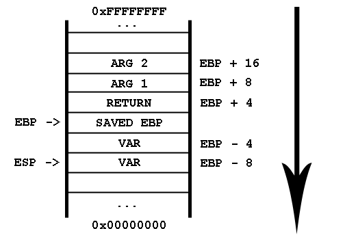

# Stack

## An Abstract Data Structure

The stack, as a data structure, functions on the LIFO (Last In First Out) concept: one can access only one element at a time, and it's always the last one.

The two operations accepted by the stack data structure are:

- `push` (add one element at the back)
- `pop` (retrieve the last element, while removing it from the stack)

## Real Life Use Case

Enough about abstract data structures for now, let's get down to the OS business!
Every process there is on your system has a stack, used for a plethora of reasons.
While the program stack has a similar behaviour with the abstract data structure from which it got its name, its role is of great interest to attackers and programmers alike:

- **it stores the return address**

   Have you ever wondered how a program knows how to return and execute the next instruction after a function call?
   Here comes the stack.
   The return address (meaning the address of the next instruction after a function call) gets **pushed** on the stack right before entering the function and **popped** at the end of the function.

   ```asm
   call my_func

   ; this is equivalent to

   inc rip
   push rip
   jmp my_func
   ```

- **it saves the content of the registers**

   Let's say we have multiple **nested** functions that all use the same `ecx` register.
   In this scenario, every nested function call overwrites the original `ecx` value (set in the previous method), therefore producing garbage results and even critical errors.
   As a result, the stack is used to preserve the values of the affected registers.

   For example, corrupting registers would look something like this:

   ```asm
   f:
       mov ecx, 1
       call g

       ; this should result in ecx = 2,
       ; however ecx gets corrupted by the function calls
       inc ecx

   g:
       mov ecx, 128
       shr ecx, 2
       call h

   h:
       xor ecx, ecx
   ```

   We should preserve the register value by saving it on stack:

   ```asm
   f:
       mov ecx, 1

       ; preserve the ecx value
       push ecx
       call g
       ; restore the ecx value, WE ARE SAFE
       pop ecx

       inc ecx

   g:
       mov ecx, 128
       shr ecx, 2

       ; preserve the ecx value
       push ecx
       call h
       ; restore the ecx value, WE ARE SAFE
       pop ecx

   h:
       ; no need to save ecx, there are no further function calls
       xor ecx, ecx
   ```

- **it stores local variables**

   Remember the local variables from C/C++?
   The ones that were disposable and didn't preserve their value between different function calls?
   Well, surprise!
   They are stored on the stack.

   For instance, the following C function gets translated to Assembly like so:

   ```C
   void my_func()
   {
        int a = 5;
   }
   ```

   ```asm
   my_func:
        ; preserve the stack frame, a special register
        push ebp
        mov ebp, esp

        ; allocate space on stack for an integer
        sub esp, 4
        ; initialize the integer with 5
        mov [esp], 5

        ; restore the stack pointer and the stack frame
        mov esp, ebp
        pop ebp
        ret
   ```

## `push` and `pop` Under the Hood

As you probably already figured, the fact that the stack operates with its last added value only means that we somehow need to store the exact address of the top somewhere.
Here comes the `esp` register.
Whenever a `push` or `pop` occurs, this register either gets decreased or increased with the size of the value stored on the stack.
You've read it right: the **`push` operation decreases the `esp` value** and a **`pop` operation increases it**!
That's because the stack grows downwards.



So, the following 4 snippets are equivalent 2 by 2:

```asm
push dword 5
```

```asm
sub esp, 4
mov [esp], dword 5
```

```asm
pop ecx
```

```asm
mov [esp], ecx
add esp, 4
```
