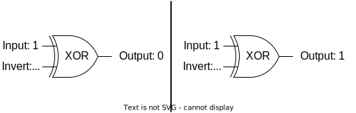

# Exclusive Or (XOR)

Exclusive or, also called "XOR" is a binary operator that behave
like a programmable inverter so as the output is true if either
first or second input is true but not both.



> You will also find XOR operation described by `⊕` symbol in textbooks.

## XOR Properties

To get familiar with how XOR operates we will take a brief look at some of its properties.

$$  0 ⊕ 0 = 0 \qquad 1 ⊕ 0 = 0 $$

$$  0 ⊕ 1 = 1 \qquad 1 ⊕ 1 = 0 $$

From now on we can determine some arithmetical attributes from that:

|||
|---|---|
|  a ⊕ (b ⊕ c) = (a ⊕ b) ⊕ c  | XOR can be applied in any order|
|  a ⊕ a = 0 | XORing a bit with itself is always 0|
|  a ⊕ 0 = a | XORing a bit with 0 doesn't change the bit value|
|  a ⊕ b = b ⊕ a  |You can flip the operands order|

## XOR Encryption

We can combine the previously mentioned properties in order to
obtain a cool property that's used for decryption:
$a ⊕ b ⊕ a = b$

The first XOR between $a$ and $b$ is the encryption part whereas the
second XOR operations marks the decryption phase:
$
ciphertext = plaintext ⊕ key\\
ciphertext ⊕ key  = plaintext ⊕ key ⊕ key = plaintext
$

We only defined the XOR as working on single bits, so to be able to
use the XOR for encryption we need to implement a bitwise XOR
function that can operate on more than one bit.

Luckily for us, Python already provide us with the `^` (caret) operator
that can be applied to integers to XOR them.
It works by XOR-ing each 2 corresponding bits of the two integers.

```python
'''
Here we can see the process of bitwise XORing two numbers
42 ⊕ 69 = 0b101010 ⊕ 0b1000101
         = 0 1 0 1 0 1 0
               ⊕         we apply the XOR operation to every one of the bits
           1 0 0 0 1 0 1
           ↓ ↓ ↓ ↓ ↓ ↓ ↓
         = 1 1 0 1 1 1 1
'''
print(int('0b1101111', 2)) # convert binary to decimal
print(42 ^ 69)

# Function to xor strings
def xor_strings(w1, w2):
        return "".join([chr(ord(a) ^ ord(b)) for a,b in zip(w1, w2)])

print(xor_strings("111","bbb").encode())
```

## OTP (One Time Pad)

At a first glance, XOR may look too simple to provide a secure
encryption scheme but it is the basis of the most secure encryption
algorithm, called a **one-time pad**.
The name suggests using a random sequence of bits called `pad` with which we XOR each bit in the plaintext.
The security is guaranteed by the fact that the pad must be only used once therefore the name.

But how exactly does OTP work?

Given a plaintext that can be translated into binary data and the
previously mentioned pad made up of random and unpredictable bits,
the attacker won't have any clue about the plaintext when they see
the ciphertext.


You will probably think "Why don't we use OTP's if it's impossible
for an attacker to decipher it if the OTP's rules are implemented
correctly?"
The problem is OTP is impractical: if the data you want to transmit
is big then the pad must be at least the size of the data.
Also you'll have to transmit the pad to other parties ahead of time
in order to get it deciphered in practical time.
