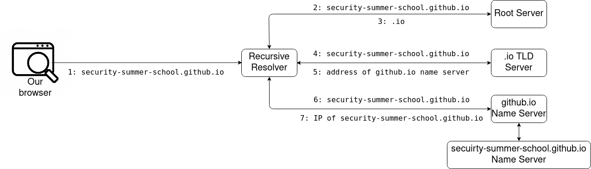

# The Domain Name System

Remember: IPs, **not URLs**, are what's used to identify hosts (web servers included) on the internet.
So there needs to be a service by which the URLs we've just learned about are mapped to IPs.
This service is called the DNS.
It organises URLs in a hierarchical manner, in order to rapidly respond to queries.
You can think of the DNS as being similar to a **phonebook of the internet**.

Here's how all of this works.
When you type `security-summer-school.github.io` into your browser, it sends a query over the internet in order to find the website associated with the URL `security-summer-school.github.io`.
A query is a question asking to look up the domain name and respond to the corresponding IP address.
Let's follow the path of this question across the internet.

In short, a DNS server performs the steps outlined [here](https://howdns.works/ep1/).

## The Recursive Resolver

The first server that the query interacts with is what's called the **recursive resolver**.
This resolver is often operated by your ISP.
It is a database of other DNS servers, which asks it forwards the same question: "What is the IP of `security-summer-school.github.io`?"

## The Root Server

The first DNS server that the recursive resolver talks to is the **root server**.
These servers are responsible for translating _top-level domains_, such as `.io`, `.com`, `.net` etc.
These root servers are few in number (only 13 across the world) and are highly secured.

## The Top-Level Domain Name Server

The next entity that processes the query is the **Top-Level Domain (TLD) Name Server**.
There are TLDs associated with each domain mentioned in the above section.
For instance, the search for `security-summer-school.github.io` will be passed to the TLD responsible for the `.io` domain.
This TLD will answer with `.io`'s IP.

## The Authoritative Name Server(s)

The last step in our lookup is **The Authoritative Name Servers** (sometimes the "authoritative" part is omitted).
We use the plural "servers" because our query may be for a subdomain.
In fact, our query for `security-summer-school.github` is one such case.
This means, that 2 name servers will fulfill the request.
The first server will fetch the IP of `.github.io` and the second will fetch the IP of the whole query (`security-summer-school.github.io`), by looking into the subdomains of `.github.io`.
This server is  to a dictionary, in which a specific domain name is translated into its IP.

## Putting it Together

As you've probably noticed, the URLs are translated to IPs _in reverse order_.
As a result, `security-summer-school.github.io` is mapped to its IP in the order:

- `.io`;
- `.github`;
- `security-summer-school`.

This makes sense, as this order gradually narrows the _scope_ in which the URL has to be searched.
It would be much more inefficient to look for `security-summer-school` across the whole internet, rather than limiting the search to the `.github.io` domain.
The fact that we are able to perform queries in this manner is proof of the hierarchical nature of IP addresses.

All in all, the DNS lookup for `security-summer-school.github.io` is the one shown below.
Notice that the Recursive Resolver acts as a mediator between most of the DNS lookups.



Notice that only the domain of a URL has its name resolved to an IP address.
The port, path, parameters and anchor are handled by the web server itself.
The DNS part is, thus, necessary in order to **find** that web server.

## `host`

In the previous section we explained the DNS.
Now let's put what we've just learned into practice.
In order to query the DNS service, we use the `host` command.
It's pretty straightforward:

```console
root@kali:~# host security.summer.school.github.io
security.summer.school.github.io has address 185.199.108.153
security.summer.school.github.io has address 185.199.110.153
security.summer.school.github.io has address 185.199.109.153
security.summer.school.github.io has address 185.199.111.153
security.summer.school.github.io has IPv6 address 2606:50c0:8002::153
security.summer.school.github.io has IPv6 address 2606:50c0:8000::153
security.summer.school.github.io has IPv6 address 2606:50c0:8003::153
security.summer.school.github.io has IPv6 address 2606:50c0:8001::153
```

Notice there are more IPs for `security.summer.school.github.io`.
The main reason for this is **load balancing**.
GitHub is accessed frequently and in order not to overload a single server, it uses multiple servers for a single domain.
Obviously, each of them serve the same web page: `security.summer.school.github.io`.
GitHub simply serves more machines to spread the workload.
