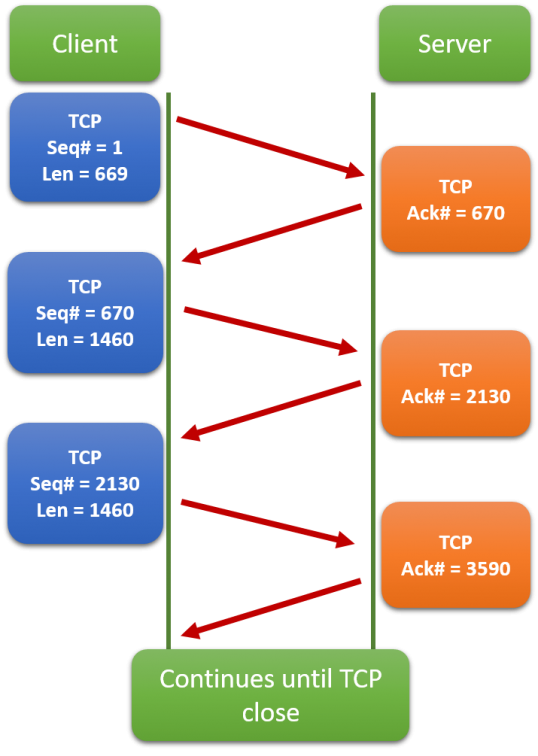

# The Transport Layer

So with IPs, we can connect two hosts however far apart they are.
So far, we managed to directly connect hosts.
Then we moved on to LANs and then to the whole Web.
This must be it, right?
We're now worldwide.
Why all the fuss about the Transport Layer.
Let's run an experiment: in your browser, open two tabs to your favourite website (which is <https://security-summer-school.github.io>, of course).
How are those connections handled?
How come what you do in one of the tabs does not interfere with what you do in the other?
IPs give us connections from host to host, but they can't differentiate between multiple connections between the same two hosts.

For this, we need another concept: **ports**.
The layer that implements these ports is called **the transport layer**.

The transport layer is the second layer of the protocol stack and sits immediately below the application layer.
At the transport layer there are two main protocols in use: **Transmission Control Protocol (TCP)** and **User Datagram Protocol (UDP)**.
More about them in just a bit.

The transport layer accepts **messages** from the application layer as application data.
It does not care if this data is part of the connection setup process, actual data to be transferred, or some other control message.
It just sees the data as a bunch of bytes to be transported to the receiving end's transport layer.

## Ports

Generally speaking, ports are endpoints used for communication.
They have no physical correspondence, but are merely logical concepts used to segregate between different processes, all running on the same host.

A port is a 16-bit number used in order to identify multiple network-using processes **on the same host**.
Notice that with IPs we were talking about identifying _hosts_ whereas now we've increased the granularity and are talking about _processes_
As a result, when a sender process wants to connect to another process (the receiver), it must specify both the port it's currently using and the port used by the receiver.

Since ports are numbers up to `2^16`, this means there are 65536 of them.
This number is enough, given that it's meant to encompass the network-using processes in the system.
However, not all of them are available for your average network application.
The **first 1024 (port numbers 0 to 1023)** of them are reserved for common system applications and services.

## TCP

The "Control" word in this protocol's name should give us a hint that TCP is about handling various errors that may occur while a packet is traversing the internet.
For this reason, TCP keeps track of the amount of data it sends and ensures it arrives in order (by buffering any out-of-order packets).
This type of tracking is made possible by the use of **sequence numbers (`Seq`)**.
In addition, the receiver sends a special message whenever it gets a segment.
This message is called **acknowledgment (ACK)**.
Each ACK is sent together with an **ACK number**.
This number signifies the amount of bytes received so far by the host.
It is used by the sender to figure out what portion of the data to send as part of the next segment.



In the above diagram we can see that the sender (client) adds some bytes (whose length is specified as `Len`) to those already sent.
At the same time, the receiver (server) adds the newly arrived bytes to those received previously and sends this number back to the client as the ACK number.

But some segments might arrive altered (some of their bits may be changed).
TCP adds what's called a **checksum** to each packet.
This checksum is computed by `xor`-ing all bytes in the segment.
When a segment is received, its checksum is recomputed and compared to the one contained within it.
If the two checksums differ, the receiver notifies the sender by sending a **not ACK (NACK)** segment instead of an ACK.
Upon receiving a NACK, the sender **retransmits** the segment.
The same mechanism is employed for segments that do not make it to the receiver.

In short, TCP makes sure that whatever is sent is received completely and correctly.
This feature is obviously important.
As a result, TCP is used for the transport-layer in the following application-level protocols and scenarios:

- **SMTP (Simple Mail Transfer Protocol)**, **IMAP (Internet Access Message Protocol)** and **POP3 (Post Office Protocol version 3)**: the main protocols used by email services worldwide.
- **HTTP/HTTPS (HyperText Transfer Protocol / Secured)**: the most popular protocol used to transfer web pages.
By default, HTTP uses port 80 and HTTPS uses port 443.
- **SSH (Secure Shell)**: a widely used protocol for obtaining a remote shell on another machine.

### SSH

We've been using `ssh` to connect to the remote machines used for challenges and tutorials.
Now we know it is a protocol used for connecting to remote hosts via a shell.
It opens a TCP connection to the remote host, where each character typed in the terminal is sent to the receiving host.

As its name suggests, the gist of this protocol is **secured**.
The security implies that the characters are not sent to the receiver as plain text, but are **encrypted**.
While we'll discuss more about encryption in the [Data Security](../data-security) session, it is important that we outline the main workings of encryption.

Upon initiating the SSH connection, an encryption algorithm is negotiated between the communicating hosts.
This algorithm performs two operations: encryption and decryption

- **Encryption** transforms data (either keys pressed by the sender, or the output from the receiver) into bytes that look random (i.e. one cannot distinguish an encrypted text and a random set of bytes).
- **Decryption** performs the opposite operation: turns encrypted bytes into plain text.

The typical `ssh` command looks like this:

```bash
ssh user@ip
```

For example:

```bash
ssh student@141.85.224.100
```

By default, SSH uses port 22.
We can specify another port by using the `-p` parameter like so:

```bash
ssh user@ip -p port
```

This is what you've been doing for the last 2 sessions in order to log onto our machines and solve challenges:

```bash
root@kali:~# ssh ctf@ip -p <some_number>
```

What you did is you created an SSH connection using a custom port which did not open a shell onto our full machines, but onto an individual [container](./further-reading.md#containers) that was hosting each challenge.
Think of a container as a lighter, albeit less secure VM.
The architecture looks like this:


### UDP

We said TCP guarantees the correctness of the delivered data, which is great.
This guarantee, however, comes at the cost of performance.
In the picture above, we saw how ACKs are transmitted.
This mechanism causes a significant temporal overhead, that we sometimes simply cannot afford.
There are services that need to transfer data really fast and, thus, they forgo the need for **datagram** correctness.
As the protocol's name suggests, UDP messages are called datagrams.
If a received packet is incorrect or if it's missing, well... too bad.
Life moves on... to the next packet and so on.
So applications usually simply discard incorrect or missing UDP datagrams.
In case you were wondering, UDP also computes the checksum, but provides no mechanism for error handling.
It's up to the application layer to deal with them.

In short, with UDP, the sender just sends its datagrams to the receiver.
Some might arrive out of order, or corrupted, but this is entirely the receiver's problem.

Moreover, with the wide implementation of optical fiber around the world, the possibility of datagrams being lost or corrupted has dropped to almost 0.
For this reason, UDP is mostly used for streaming services:

- YouTube
- Netflix
- Discord
- Spotify
- PornHub

Since an image is worth 1000 words, here's a summary of TCP and UDP:


