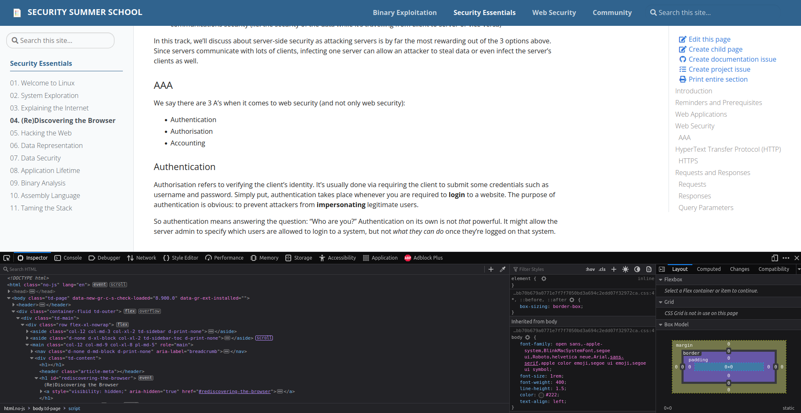
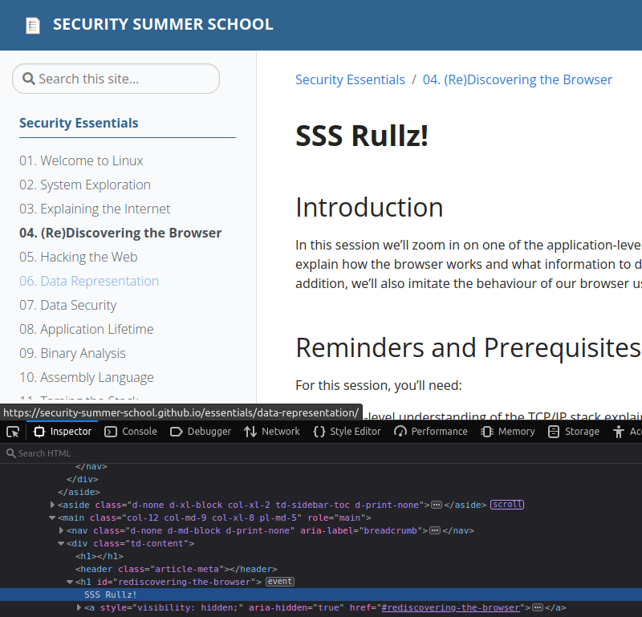
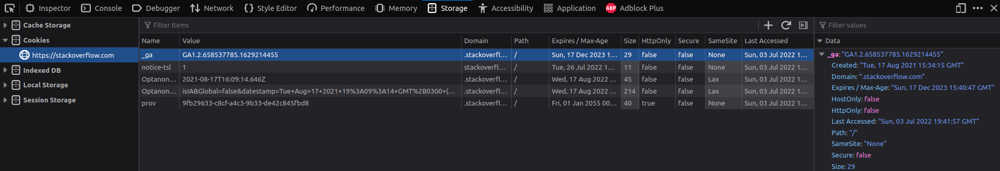

# Developer Tools

All modern browsers have the ability to assist developers in creating, previewing, testing and debugging their web applications.
This ability comes in the form of the **Developer Tools** suite.
You can open the Developer Tools by pressing either `F12` or `Ctrl + Shift + c` when browsing through a website.

## Inspector

The first "tab" we see in the Developer Tools is called _Inspector_.
It displays the HTML source of the page we are viewing.
This structure is called the [Document Object Model](../explaining-the-internet#the-document-object-model-dom).
We can even modify the content of the HTML document

Of course, this modification is only visible to me because I'm modifying my local copy of the `index.html` file.

## Console

This tab is pretty straightforward.
It is a shell in which we can write JavaScript code.

## Debugger

This tab displays all the files loaded by the web page and allows you to run the JavaScript code step by step.
Hence its name: _Debugger_

### Sources

The "Sources" sub-tab of the "Debugger" tab shows the hierarchical structure of all files used by the web page.
These files can be HTML files, CSS files images, videos, JavaScript files, anything.

Notice the file `(index)` is actually the same we saw in [Inspector](#inspector).

## Network

The network tab shows detailed information about every file loaded and every request and response made by the page.
Notice the sub-tabs to the right.
here you can find in-depth information about the HTTP requests, such as HTTP parameters, HTTP methods (`GET`, `POST` etc.), HTTP status codes (200, 404, 500, etc.), loading time and size of each loaded element (image, script, etc).
Furthermore, clicking on one of the requests there, you can see the headers, the preview, the response (as raw content) and others.
This is useful for listing all the resources needed by a page, such as if there are any requests to APIs, additional scripts loaded, etc.

Here we can also see the cookies sent with each request.

## Storage

Viewing cookies in the "Network" tab is fine, but that only gives us their value.
If we want to see all their attributes **and change their value**, we need to go over to the "Storage" tab.

Let's take a closer look at one cookie called `_ga`.
It comes form "Google Analytics".
This is a service provided by Google that **definitely does not spy on users**, but it uses [cookies like this one](https://developers.google.com/analytics/devguides/collection/gtagjs/cookie-usage#gtagjs_google_analytics_4_-_cookie_usage) to give website owners statistics about their visitors.
So it's literally spying and tracking users' behaviour.

Let's troll them by modifying their cookie
Its contents are explained [here](https://stackoverflow.com/a/16107194).
But we're just going to mess with it.

There!
We showed Big Tech not to mess with us!
