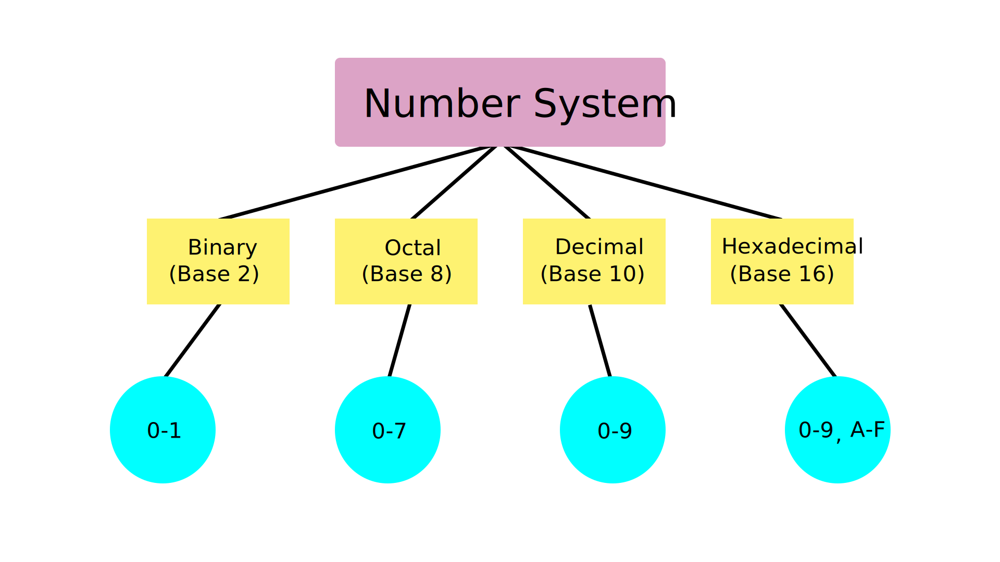

# Data Representation

## Table of Contents

Use [gh-md-toc](https://github.com/ekalinin/github-markdown-toc).

## Introduction

In today's session we'll discuss about data and the many ways we can represent it.

## Reminders and Prerequisites

For this session you'll need:
- Basic knowledge of Python (as seen in the [first session](..//welcome-to-linux/))
- Numbers

## What is Data?

Data is information.
This plain text is data, but more than that, data can be encoded and represented in many ways.

Generally, we represent data in a suitable format for our specific purpose.

For example, if we want the most basic way to encode data, the one that computers "think" in, we'll use `Binary`.

Sometimes, we need our data to not be confused with something else, so, for example we encode `Binary` to `Base-64` in order to get the information on the other side of the wire uncorrupted.

## Data Formats

### Number Systems
Number Systems are a method of representing numbers by mathematical combinations of symbols.


#### `Decimal`
Decimal or Base-10 uses 10 digits (0-9). It's the `human` way to represent numbers.

#### `Binary `
Binary or Base-2 only uses two digits (0 and 1).

0 and 1 are called `bits` and `8 bits = 1 byte`.

Computers store data in bites and bytes.

But why do computers do this?

Hardware prefers them, since it is easier to associate with electrical signals:


#### `Hexadecimal`
Hexadecimal or Base-16 uses 10 digits (0-9) and 6 alphabet letters (A-F). We can look at hexadecimal data as a shortcut for the binary system.

Let's say we have `0b10101001` (`10101001`).

I assume you can safely say that since we have 8 bits, it will be `< 256`.

Its hexadecimal form is `0xa9` (`a9`).

Thus, if we want to convert it to `decimal`, instead of doing 8 steps:

$(1 × 2^7) + (0 × 2^6) + (1 × 2^5) + (0 × 2^4) + (1 × 2^3) + (0 × 2^2) + (0 × 2^1) + (1 × 2^0) = 169$

we only do 2 steps:

$(a × 16^1) + (9 × 16^0) = 169$

TODO(Cod Python)

#### `Octal`
Octal or Base-8 uses 8 digits (0-7). It is the least popular of the aforementioned 4, but an interesting use of it is in the Unix File Permissions system:


### Character Encoding

#### `ASCII`

ASCII (American Standard Code for Information Interchange):
Going from 0 - 127

```
DEC HEX ASCII       DEC HEX ASCII       DEC HEX ASCII       DEC HEX ASCII       DEC HEX ASCII  
0   00  NUL         26	1A  SUB         52  34  4           78  4E  N           104 68  h     
1   01  SOH         27  1B  ESC         53  35  5           79  4F  O           105 69  i
2   02	STX         28	1C  FS          54  36  6           80  50  P           106 6A	j
3   03	ETX         29	1D  GS          55  37  7           81  51  Q           107 6B	k
4   04	EOT         30	1E  RS          56  38  8           82  52  R           108 6C	l
5   05	ENQ         31	1F  US          57  39  9           83  53  S           109 6D	m
6   06	ACK         32	20  SPACE       58  3A  :           84  54  T           110 6E	n
7   07	BEL         33	21  !           59  3B  ;           85  55  U           111 6F	o
8   08	BS          34	22  "           60  3C  <           86  56  V           112 70	p
9   09	HT          35	23  #           61  3D  =           87  57  W           113 71	q
10  0A	LF          36	24  $           62  3E  >           88  58  X           114 72	r
11  0B	VT          37	25  %           63  3F  ?           89  59  Y           115 73	s
12  0C	FF          38	26  &           64  40  @           90  5A  Z           116 74	t
13  0D	CR          39	27  '           65  41  A           91  5B  [           117 75	u
14  0E	SO          40	28  (           66  42  B           92  5C  \           118 76	v
15  0F	SI          41	29  )           67  43  C           93  5D  ]           119 77	w
16  10	DLE         42	2A  *           68  44  D           94  5E  ^           120 78	x
17  11	DC1         43	2B  +           69  45  E           95  5F  _           121 79	y
18  12	DC2         44	2C  ,           70  46  F           96  60  `           122 7A	z
19  13	DC3         45	2D  -           71  47  G           97  61  a           123 7B	{
20  14	DC4         46	2E  .           72  48  H           98  62  b           124 7C	|
21  15	NAK         47	2F  /           73  49  I           99  63  c           125 7D	}
22  16	SYN         48	30  0           74  4A  J           100 64  d           126 7E	~
23  17	ETB         49	31  1           75  4B  K           101 65  e           127 7F
24  18	CAN         50	32  2           76  4C  L           102 66  f 
25  19	EM          51	33  3           77  4D  M           103 67  g 
```

In terms of storage efficiency, we can encode

`UTF-8` for ASCII text (English and other Western languages)

`UTF-16` for non-ASCII text (Chinese and other Asian languages)

#### `Base64`

Base64 is a way of representing binary data in sequences of 24 bits that can be represented by 4 Base64 digits.

SGVsbG8gZnJvbSB0aGUgRWFydGgtNjQgIQ==


## Data Manipulation

We can manually change the way data is represented, so that it will be easier to read or structure.

For large chunks of data, this could take a long time, so, in order for us to be efficient, we will have to use certain automated ways of manipulating the information.

Tools that can help us achieve this goal are ranging from programming and scripting languages, to programs like MS Excel.

For this session's purpose, we will mainly focus on Python as already seen in [Session 1](https://security-summer-school.github.io/essentials/welcome-to-linux/)


## Summary

- Summarizing session concepts
- Summarizing commands / snippets that are useful for tutorials, challenges (easy reference, copy-paste)

## Activities

Tasks for the students to solve. They may be of two types:
- **Tutorials** - simpler tasks accompanied by more detailed, walkthrough-like explanations
- **Challenges** - the good stuff

## Further Reading

Any links or references to extra information.
