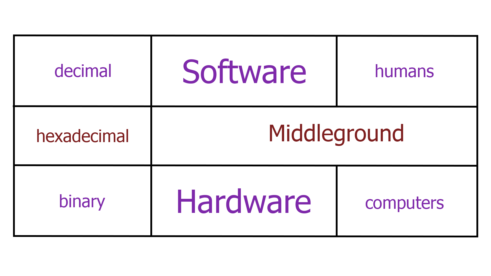
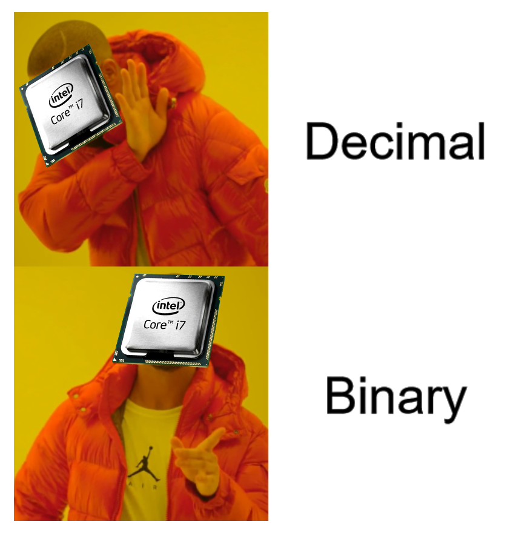
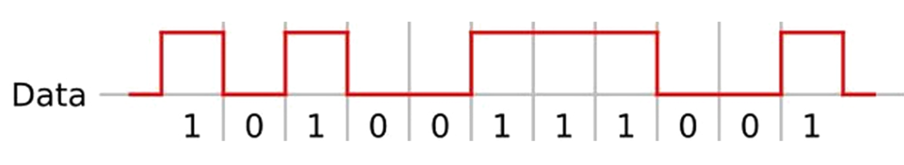
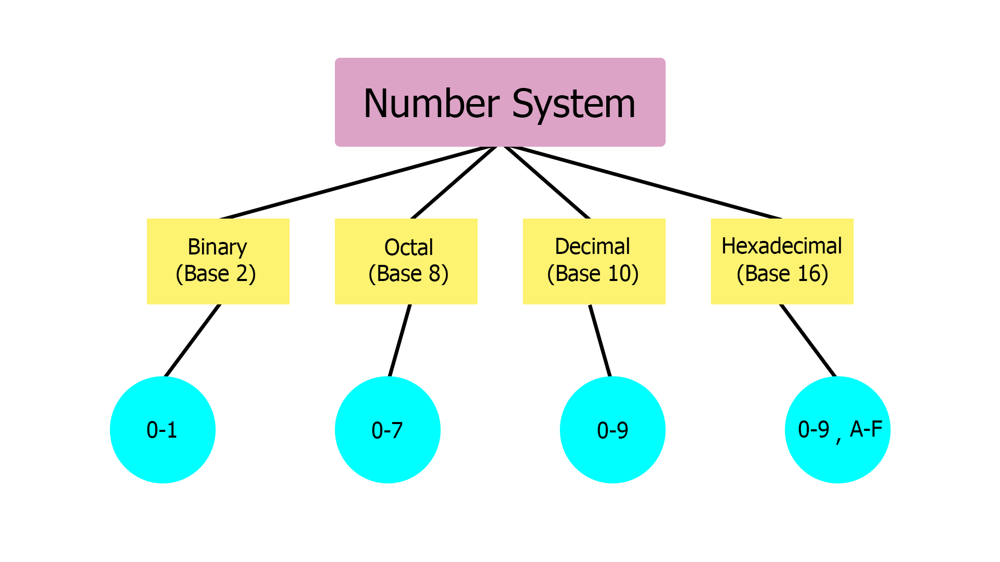

# Data Representation

## Table of Contents

Use [gh-md-toc](https://github.com/ekalinin/github-markdown-toc).

## Introduction

In today's session we'll discuss about data and the many ways we can represent it.

## Reminders and Prerequisites

For this session you'll need:
- Basic knowledge of Python (as seen in the [first session](..//welcome-to-linux/))
- Numbers

## What is Data?

Data is information.
This plain text is data, but more than that, data can be encoded and represented in many ways.  
Generally, we represent data in a suitable format for our specific purpose.  
For example, if we want the most basic way to encode data, the one that computers "think" in, we'll use `Binary`.  
Sometimes, we need our data to not be confused with something else, so, for example we encode `Binary` to `Base-64` in order to get the information on the other side of the wire uncorrupted.

## Data Formats

### Numeral Systems
Numeral Systems are a method of representing numbers by mathematical combinations of symbols.



Humans prefer the `decimal` numeral system (also know as Base-10), since it provides better readability.  
Therefore, written software (i.e. code) is mostly `Base-10`, as humans write software far more than they build hardware.

Computers, on the other hand, use binary (or Base-2), the numerical system that uses two digits (0 and 1), which are also known as `bits` and `bytes` (1 byte = 8 bits)



But why?  
Hardware prefers them, since they are associated easier with electrical signals:



Of course, there is also an in-between: Hexadecimal.  
Also known as Base-16, it uses 10 digits (0-9) and 6 alphabet letters (A-F).   
Hexadecimal data is both readable and tightly correlated to the binary representation.  
Let's say we have `0b10101001` (`10101001`).  
I assume you can safely say that since we have 8 bits, it will be `< 256`.  
Its hexadecimal form is `0xa9` (`a9`).  
Thus, if we want to convert it to `decimal`, instead of doing 8 steps:

$(1 × 2^7) + (0 × 2^6) + (1 × 2^5) + (0 × 2^4) + (1 × 2^3) + (0 × 2^2) + (0 × 2^1) + (1 × 2^0) = 169$

we only do 2 steps:

$(a × 16^1) + (9 × 16^0) = 169$

Some conversions:
```py
# binary <――> decimal
def binToDec(n):
    return int(n,2)

def decToBin(n):
    return bin(n)

# hexadecimal <――> decimal
def hexToDec(n):
    return int(n, 16)

def decToHex(n):
    return hex(n)

# binary <――> hexadecimal
def binToHex(n):
    return(decToHex(binToDec(n)))

def hexToBin(n):
    return(decToBin(hexToDec(n)))

# Back and forth conversions
if __name__ == '__main__':
    print(f"0b1111 ―――> {binToDec('0b1111')}")
    print(f"15 ―――> {decToBin(15)}")

    print(f"0xa9 ―――> {hexToDec('0xa9')}")
    print(f"169 ―――> {decToHex(169)}")

    print(f"0b111101111011 ―――> {binToHex('0b111101111011')}")
    print(f"0xf7b ―――> {hexToBin('0xf7b')}")
```

And their output:
```
0b1111 ―――> 15
15 ―――> 0b1111
0xa9 ―――> 169
169 ―――> 0xa9
0b111101111011 ―――> 0xf7b
0xf7b ―――> 0b111101111011
```

#### `Octal`
Octal or Base-8 uses 8 digits (0-7).  
It is the least popular of the aforementioned 4, but an interesting use of it is in the Unix File Permissions system:

Here is a table that shows what each permissions does on a file, respectively on a directory.


Each file/directory has three sets of permissions:
`Owner`,
`Group Owner`,
`Others`

So, if we want to view the permissions of a file/directory we execute:
```bash
root@kali:~# ls -l File_Name
-rwxrw-r-- 1 root root 1000 Sep 10 2020 File_Name
-[-][-][-]   [--] [--]
| |  |  |     ||   ||
| |  |  |     ||   ||
| |  |  |     ||   ++----------------> 6. Group
| |  |  |     ++---------------------> 5. Owner
| |  |  +----------------------------> 4. Others Permissions
| |  +-------------------------------> 3. Group Permissions
| +----------------------------------> 2. Owner Permissions
+------------------------------------> 1. File Type
```


An overview of the presented `Numeral Systems`:


### Character Encoding

#### `ASCII`

ASCII (American Standard Code for Information Interchange):
Going from 0 - 127

```
DEC HEX ASCII       DEC HEX ASCII       DEC HEX ASCII       DEC HEX ASCII       DEC HEX ASCII  
0   00  NUL         26	1A  SUB         52  34  4           78  4E  N           104 68  h     
1   01  SOH         27  1B  ESC         53  35  5           79  4F  O           105 69  i
2   02	STX         28	1C  FS          54  36  6           80  50  P           106 6A	j
3   03	ETX         29	1D  GS          55  37  7           81  51  Q           107 6B	k
4   04	EOT         30	1E  RS          56  38  8           82  52  R           108 6C	l
5   05	ENQ         31	1F  US          57  39  9           83  53  S           109 6D	m
6   06	ACK         32	20  SPACE       58  3A  :           84  54  T           110 6E	n
7   07	BEL         33	21  !           59  3B  ;           85  55  U           111 6F	o
8   08	BS          34	22  "           60  3C  <           86  56  V           112 70	p
9   09	HT          35	23  #           61  3D  =           87  57  W           113 71	q
10  0A	LF          36	24  $           62  3E  >           88  58  X           114 72	r
11  0B	VT          37	25  %           63  3F  ?           89  59  Y           115 73	s
12  0C	FF          38	26  &           64  40  @           90  5A  Z           116 74	t
13  0D	CR          39	27  '           65  41  A           91  5B  [           117 75	u
14  0E	SO          40	28  (           66  42  B           92  5C  \           118 76	v
15  0F	SI          41	29  )           67  43  C           93  5D  ]           119 77	w
16  10	DLE         42	2A  *           68  44  D           94  5E  ^           120 78	x
17  11	DC1         43	2B  +           69  45  E           95  5F  _           121 79	y
18  12	DC2         44	2C  ,           70  46  F           96  60  `           122 7A	z
19  13	DC3         45	2D  -           71  47  G           97  61  a           123 7B	{
20  14	DC4         46	2E  .           72  48  H           98  62  b           124 7C	|
21  15	NAK         47	2F  /           73  49  I           99  63  c           125 7D	}
22  16	SYN         48	30  0           74  4A  J           100 64  d           126 7E	~
23  17	ETB         49	31  1           75  4B  K           101 65  e           127 7F
24  18	CAN         50	32  2           76  4C  L           102 66  f 
25  19	EM          51	33  3           77  4D  M           103 67  g 
```

We can see that by adding 32 to an uppercase letter, we get that same letter in lowercase:  
e.g. $E + 32 = e$

Below, you can see the built-in Python functions `ord` and `chr` that help us determine what character coresponds to a certain ASCII code and what ASCII code a character has.
```py
>>> ord('E')
69
>>> chr(69)
'E'
>>> chr(ord('E') + 32)
'e'
>>> chr(ord('e') - 32)
'E'
>>>
```

In terms of storage efficiency, we can encode

`UTF-8` for ASCII text (English and other Western languages)

`UTF-16` for non-ASCII text (Chinese and other Asian languages)

Let's say we have a string in Chinese. With Python, we can get the hex bytes of the string, using the built-in function `str.encode()`:
```py
Str = ("老板")
print(Str)

Str = (("老板").encode("utf-8"))
print(Str)
```
The output will be:
```
老板
b'\xe8\x80\x81\xe6\x9d\xbf'
```
If we want to get back to the original string, we will execute:
```py
print((Str.decode()))
```
And we will get:
```
老板
```

#### `Base64`

Base64 is a way of representing binary data in sequences of 24 bits (3 bytes) that can be represented by 4 Base64 digits.

Base64 Encoding Table:
```
Index   Char      Index   Char      Index   Char      Index   Char        
0       A         16      Q         32      g         48      w   
1       B         17      R         33      h         49      x
2       C         18      S         34      i         50      y
3       D         19      T         35      j         51      z
4       E         20      U         36      k         52      0
5       F         21      V         37      l         53      1
6       G         22      W         38      m         54      2
7       H         23      X         39      n         55      3
8       I         24      Y         40      o         56      4
9       J         25      Z         41      p         57      5
10      K         26      a         42      q         58      6
11      L         27      b         43      r         59      7
12      M         28      c         44      s         60      8
13      N         29      d         45      t         61      9
14      O         30      e         46      u         62      +
15      P         31      f         47      v         63      /
```

If we want to convert to and from Base64 in Python we can use the `base64` module:
```py
import base64

message = "Some random message"
message_bytes = message.encode('ascii') # We transform the string to "b'Some random message'", making it a sequence of bytes
base64_bytes = base64.b64encode(message_bytes) 
base64_message = base64_bytes.decode('ascii') # We do the opposite of the previous process, now eliminating "b''", to make it a string

print(base64_message)
```
Thus getting us to the base64 string:
```
U29tZSByYW5kb20gbWVzc2FnZQ==
```

If we would want to decode it, we would have to simply revert the commands as follows:
```py
import base64

base64_message = 'U29tZSByYW5kb20gbWVzc2FnZQ=='
base64_bytes = base64_message.encode('ascii')
message_bytes = base64.b64decode(base64_bytes)
message = message_bytes.decode('ascii')
```
Which will get us back to:
```
Some random message
```

As you can see, some Base64 strings have "=" at the end, some have "==" and others have nothing uncommon.  
Since Base64 represents binary data in 3 bytes, we should also know how to treat the case when the length is not divisible by 3.  
As a consequence, there is output padding for Base64 as follows:

```
length % 3 = 1 => "=="
length % 3 = 2 => "="
length % 3 = 0 => no padding
```

Try decoding yourself!
```
SGVsbG8gZnJvbSB0aGUgRWFydGgtNjQgIQ==
```

#### `Hashing`

A good way to compress data is represented by hashing.  
Data can be stored in hashes; hashes can be stored in hash tables, thus enabling quicker data lookup.

But how does it work?

A hashing algorithm is a mathematical algorithm that converts an input data array of a certain type and arbitrary length to an output bit string of a fixed length.  
The process is one-way, as you cannot convert a hash back to the original data.  
Hashes establish identity, because they are unique. So we use hashes for data encryption.  
We can store passwords as MD5, SHA-1 or SHA-2 (most popular ones), so that in case of a security breach, the real passwords are still hidden.  

## Data Manipulation

We can manually change the way data is represented, so that it will be easier to read or structure.

For large chunks of data, this could take a long time, so, in order for us to be efficient, we will have to use certain automated ways of manipulating the information.

Tools that can help us achieve this goal are ranging from programming and scripting languages, to programs like MS Excel.

For this session's purpose, we will mainly focus on Python as already seen in [Session 1](../welcome-to-linux/)


## Summary

- Summarizing session concepts
- Summarizing commands / snippets that are useful for tutorials, challenges (easy reference, copy-paste)

## Activities

Tasks for the students to solve. They may be of two types:
- **Tutorials** - simpler tasks accompanied by more detailed, walkthrough-like explanations
- **Challenges** - the good stuff

## Further Reading

[pandas (Python Tool for Data Manipulation)(1)](https://pandas.pydata.org/docs/getting_started/)  
[pandas (Python Tool for Data Manipulation)(2)](https://www.w3schools.com/python/pandas/default.asp)
