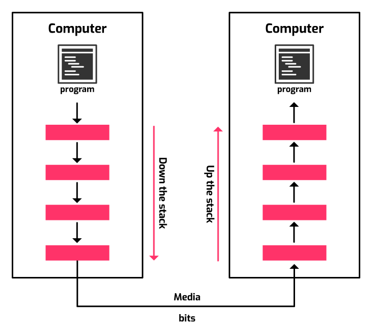
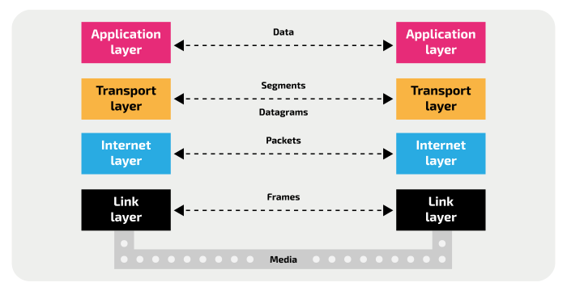
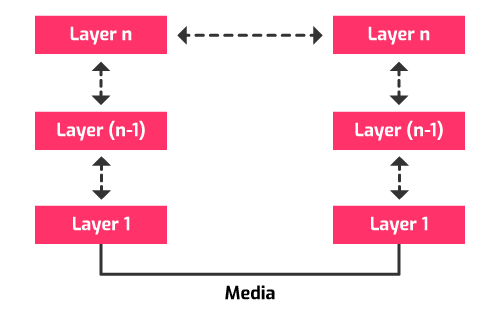
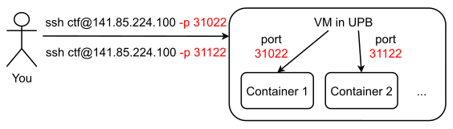
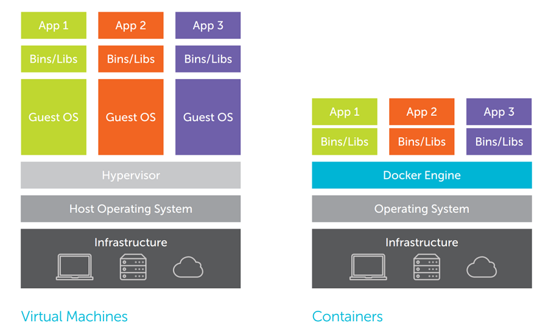

# Explaining the Internet

## Introduction

In this session, we'll discuss some networking fundamentals.
By doing so, we'll lay the foundations for some of our later sessions regarding networking and the Internet, such as [(Re)Discovering the Browser](../rediscovering-the-browser)
and [Hacking the Web](../hacking-the-web).

Moreover, we'll explain what happens when you access a URL (we'll also learn how to do this from our terminals).
Last but not least, we'll see what those `ssh` commands you've been using in order to solve the remote challenges mean.

## Reminders and Prerequisites

For this session, you'll need:
- a working internet connection;
- a Linux environment that you're comfortable working with;
- to understand what a *process* is;
- general knowledge of the Linux CLI, as discussed in session [Welcome to Linux](../welcome-to-linux).

## A General Overview of the Internet

Before learning how to use and, later, how to hack the Internet, let's first understand its building blocks.
The Internet is all about sending data to and from an enormous amount of hosts.

In order to learn how all of this works, let's start from the example below.
It's generic enough for it to be relatable to most networking scenarios.
Yet, it encompasses everything we need to talk about.



So what happens here is that the computer on the left is trying to **send** data to the one on the right.
We call the left computer **the sender** and the right one **the receiver**.
The two computers are connected via a **medium** on which the actual bits of data that make up the communication are sent.
In short, this medium is the connection between the aforementioned computers.

However, there are 4 boxes above the aforementioned medium.
These boxes are altogether known as **The TCP/IP Network Stack**.
We'll see what's with the *TCP/IP* part soon enough.
Individually, each box is a **layer**.
Here are the 4 layers of the TCP/IP stack:



Each layer provides a well-defined set of requirements, which are fulfilled by **protocols**.
A networking protocol is a set of rules that define the communication (data formatting and processing) between the same two levels of the network stack.
For example, there are protocols for the transport layer, others for the link layer and so on.
We'll talk about them in a bit.

### Encapsulation

Each layer takes care of a specific requirement of networking, as we'll discuss shortly.
When sending data, each of the layers in the TCP/IP model accepts data from the layer above (or from the user in the case of the application layer), and adds additional information to the data that is necessary for that layer to carry out its task.
In some cases, the original data may be processed in some way before the additional information is added.
For example, it might be encrypted.
The layer then passes this data on to the layer below (or onto the transmission medium in the case of the link layer).

The arrival of data from an upper layer may trigger additional separate messages to be sent to the receiving end.
For instance, if the data needed to be encrypted, the layer that carries out the encryption has to exchange initial setup messages with the receiving end to agree the encryption method and other data that we'll touch on in the session [Data Security](../data-security), before the encrypted data can be transferred.

At the receiving end, the process happens in reverse: each layer accepts data from the layer below, inspects and removes the additional information added on by the corresponding layer in the sending end, before passing it up to the layer above.

Data is passed from a sender process to a receiver process by using the services of the layer below.
It is only the final layer that actually causes the data to be transmitted onto the transmission media (e.g. cable). Below is a representation of this whole mechanism.



This method of modular communication is called **encapsulation**.
It can be likened to taking the data from the layer above and placing it in an **envelope**, writing some additional information on the envelope, then passing the envelope to the layer below.
At the receiving end, a layer is passed an envelope from the layer below.
It looks at the data on the outside of the envelope to decide what to do with the contents of the envelope.
It then opens the envelope and passes the contained data up to the next level. The reverse of encapsulation is **decapsulation**.
After a message has passed through the network stack, it ends up in a _matrioshka_ of envelopes, one for each layer, each with its own, specific information.

### A Bit of Nomenclature

As we said previously, each of the layers of the TCP/IP model adds its own information to the data coming from the layer above.
This encapsulation at each layer results in a new structure effectively wrapping up the original data.
Each of these has a specific name depending on the layer that creates it:

| TCP/IP Layer | Name of data block produced by the layer |
|:------------:|:----------------------------------------:|
| Application  | Application data (e.g. HTTP, HTTPS)      |
| Transport    | Segments (TCP) or datagrams (UDP)        |
| Internet     | Packets (e.g IP packet)                  |
| Link         | Frames (e.g. Ethernet frame)             |

## The Medium 

This layer is not mentioned in the above diagrams, but is worth talking a little bit about.
The medium represents the connection itself between the 2 stations.
This connection can be:
- **wired**: using a cable on which digital signals that encode the bits are sent
- **wireless**: using high-frequency radio waves in order to send the same signals as before

## The Link Layer

This layer is also known as the **Data Link** layer.

It represents the underlying technology of any application.
The device on which the application is running may have a choice of many technologies to connect to a network, such as Ethernet, WiFi, Bluetooth, 4G, 5G (_tinfoil hat off_) etc.
Where more than one link exists, the operating system of the device chooses the most appropriate link.
For instance, a mobile phone might be connected to both 4G and WiFi.
Most mobile phones prefer the WiFi connection, but remain connected to 4G mobile data, which they use as backup. 
However, in some cases the application itself may dictate the choice of link, e.g. the mobile phone may decide to send traffic over WiFi to avoid 4G data charges.
Once the link has been chosen, the appropriate link layer protocol is selected.

The most commonly used link layer protocol is **Ethernet**.
Wired or wireless Ethernet is used on most local area networks (LANs).
The packets from the internet layer are further encapsulated in Ethernet frames which are designed to be transported across a local network.

This layer needs a means to identify local stations.
This is where the **Media Access Control (MAC) addresses** come in.
They are 48 bits long and are unique to a specific **Network Interface Card (NIC)**.
The MAC address is physically tied to the hardware of the computer, which means it may also be referred to as the hardware or physical address.

## The Internet Layer

So each NIC has its own 48-bit MAC address.
This means there are `2^48` unique MACs, which means `2^48` unique NICs.
`2^48` is a huge number, which is way beyond everything humanity has produced so far.
So, since we aren't likely to run out of MAC addresses any time soon, a host can be easily identified in the Internet via its MAC, right?
Yes, it can.

There is one problem, though.
Suppose the sender is in the US and the receiver is in India.
There's no way you can connect these two hosts using the same medium.
You need some intermediaries: **routers**.

### Routers

It is impossible to connect your PC / laptop directly (physically) to every PC or server in the world.
Therefore, we need **networks**, which are basically aggregations of hosts (servers, PCs, laptops, mobile phones etc.).

Each network contains one **router** which sends data between the hosts in its network and those on other networks.
So a router is a networking device that connects two or more networks.
Think of the router you most probably have at home.
There is a *local network*, to which you can connect via WiFi, or Ethernet cables.
You're probably doing this right now.
Another network is the one provided by your Internet Service Provider (ISP).

There are many ISPs around the world and even more local home networks.
The web thus becomes a _web of routers_ who transmit **packets** from one network to another.
Back to our example above, you will surely need many routers to get a packet from the US to India.

But how does a router know how where to send a packet?
Let's say a router R1 connects a laptop with IP 192.168.100.5 and a PC with IP 192.168.100.10 to the external network, as shown in the image below.


Now let's look at 2 different scenarios:
1. If the laptop sends a packet to IP `192.168.100.10`, the router knows this address is part of its **Local Area Network (LAN)** and sends it directly to the PC.
1. If the PC sends a packet to `upb.ro` (with IP `141.85.220.33`), the router sees its IP as an external address. Therefore, it passes it into the internet, where other routers take it and then pass it again to other routers and so on, until the packet reaches `upb.ro`.

Each new router that a packet encounters on its way from source to destination is called a **hop**.
Most often, a hop is a router.
In order to visualise the hops that our requests to a well-known service, such as `google.com`, we use the `traceroute` command:
```
┌──(kali㉿kali)-[~]
└─$ traceroute google.com
traceroute to google.com (142.250.185.206), 30 hops max, 60 byte packets
 1  _gateway (10.0.2.2)  0.212 ms  0.123 ms  0.228 ms
 2  10.20.21.254 (10.20.21.254)  2.815 ms  3.908 ms  3.838 ms
 3  109.101.201.49 (109.101.201.49)  4.894 ms  4.971 ms  4.810 ms
 4  193.231.103.0 (193.231.103.0)  9.634 ms  9.467 ms  9.359 ms
 5  10.0.241.109 (10.0.241.109)  8.547 ms  9.129 ms  9.958 ms
 6  * * *
 7  10.0.240.194 (10.0.240.194)  59.356 ms  39.555 ms 10.0.200.6 (10.0.200.6)  39.579 ms
 8  10.0.240.121 (10.0.240.121)  39.426 ms  39.373 ms  38.338 ms
 9  92.87.30.10 (92.87.30.10)  42.521 ms  39.938 ms  41.795 ms
10  * 10.252.185.126 (10.252.185.126)  40.778 ms *
11  142.250.226.148 (142.250.226.148)  38.924 ms 172.253.73.152 (172.253.73.152)  41.083 ms 108.170.252.1 (108.170.252.1)  42.216 ms
12  142.250.225.77 (142.250.225.77)  39.563 ms 108.170.252.18 (108.170.252.18)  40.317 ms 142.250.225.77 (142.250.225.77)  36.148 ms
13  fra16s52-in-f14.1e100.net (142.250.185.206)  40.195 ms 209.85.242.79 (209.85.242.79)  39.355 ms 108.170.236.249 (108.170.236.249)  38.919 ms
```
Let's explain the output.
Each line represents a **hop** (i.e. a router) that a packet must pass through in order to reach `google.com`.
The first number is the index of the hop.
The second is the _IP_ of the network.
You've probably heard about IPs before.
We'll demystify them in a bit.
`traceroute` sends 3 packets, for consistency.
It counts the time it takes from sending each of these packets to the moment the response reaches the sender.
This time is called **Round Trip Time (RTT)**.
As we said, `traceroute` sends and monitors 3 packets in order to display the consistency of the link to each hop.

The first hop is between the VM and the host.
The other is the router to which the host is connected.
From then on, it's the wild Internet itself.

### IP Addresses

IP addresses or, in short, **IPs**, are 32-bit (i.e. 4 bytes) numbers used to identify **hosts**.
IP stands for **Internet Protocol**, which is the most widely used internet layer protocol.
Notice the difference between IPs and MACs.
While MACs are associated with NICs, IPs are associated with hosts.
Another difference is that whereas a MAC is unique to and engraved into the NIC, a host can change its IP more easily.
We won't go into this in today's session, but you can read about one such mechanism called [DHCP](#dhcp). 

Of course you are free to express an IP address however you like, but by far the most common representation is to write each of its 4 bytes individually, in the decimal base, separated by a dot (`.`).
You've already seen IP's when connecting to the remote hosts during the previous sessions.
Some IPs are:
- `8.8.8.8`: is the address of Google's Public DNS Service.
We'll explain what the DNS is in a future [section](#the-domain-name-system).
- `69.63.176.13`: is a common IP address used by Facebook
- `141.85.224.100`: is IP the address of one of the machines in our CTF infrastructure

In order to see the IP of your machine, run the following command:
```
┌──(kali㉿kali)-[~]
└─$ ip address show
1: lo: <LOOPBACK,UP,LOWER_UP> mtu 65536 qdisc noqueue state UNKNOWN group default qlen 1000
    link/loopback 00:00:00:00:00:00 brd 00:00:00:00:00:00
    inet 127.0.0.1/8 scope host lo
       valid_lft forever preferred_lft forever
    inet6 ::1/128 scope host 
       valid_lft forever preferred_lft forever
2: eth0: <BROADCAST,MULTICAST,UP,LOWER_UP> mtu 1500 qdisc pfifo_fast state UP group default qlen 1000
    link/ether 08:00:27:3c:2a:8d brd ff:ff:ff:ff:ff:ff
    inet 10.0.2.15/24 brd 10.0.2.255 scope global dynamic noprefixroute eth0
       valid_lft 86379sec preferred_lft 86379sec
    inet6 fe80::262a:29ff:8129:db77/64 scope link noprefixroute 
       valid_lft forever preferred_lft forever
```
Your output may differ slightly.

An IP address is associated with a **network interface**.
These interfaces can be virtual or physical (present on your NIC).
In your Kali VM, all interfaces are virtual.

**`lo`** is the **loopback** interface.
It's an internal interface that each host possesses.
Its purpose is for testing the OS's TCP/IP stack.
Its IP is, by convention `127.0.0.1`, or `0.0.0.0`.

**`eth0`** is the interface used to connect to the Internet.
It acts as a middleman between your host OS (the one in which you're running the VM) and the guest OS (Kali).
Its status is *UP* (i.e. it's running) and its IP address is `10.0.2.15`.

Notice the `/24` part.


#### `ping`

In order to test whether a host is up or down, we can `ping` its IP.
`ping` sends packets to the given host (IP or website) and reports whether the host responds or not.
If it responds, it's obviously alive.
Otherwise... it's complicated.
It can either be dead itself, **or there can be no route to it**.
If we consider that the connection between us and our pinged host is _mediated_ by a chain of routers, as shown in the image above, if **one** of those routers is down and doesn't transmit packets, then we may be unable to reach the pinged host.
So a better wording is to say that when a host doesn't respond to pings, it's not necessarily _down_, but merely **unreachable**.
From a host's point of view though, it's irrelevant whether a host is down for real or not.
An unreachable host is as good as a dead one: _useless_.

`localhost`, in other words. the `lo` interface, should **always** be up and respond to pings.
In case it doesn't, well... your kernel's TCP/IP stack may be broken.
We use the `-c 3` parameter to only send 3 "pings" to `localhost`.
Otherwise, `ping` sends packets continuously, until stopped manually (with `ctrl + c`).
```
┌──(kali㉿kali)-[~]
└─$ ping -c 3 127.0.0.1
PING 127.0.0.1 (127.0.0.1) 56(84) bytes of data.
64 bytes from 127.0.0.1: icmp_seq=1 ttl=64 time=0.040 ms
64 bytes from 127.0.0.1: icmp_seq=2 ttl=64 time=0.060 ms
64 bytes from 127.0.0.1: icmp_seq=3 ttl=64 time=0.046 ms

--- 127.0.0.1 ping statistics ---
3 packets transmitted, 3 received, 0% packet loss, time 2053ms
rtt min/avg/max/mdev = 0.040/0.048/0.060/0.008 ms
```

`ping` also tells us the RTT to the pinged host.
Notice the very small times when pinging ourselves.
This makes sense, since there are no hops (routers) between a host and itself.

Now let's ping a remote server, say `google.com`.
We can `ping` either an IP or a URL.
```
┌──(kali㉿kali)-[~]
└─$ ping -c 3 google.com
PING 8.8.8.8 (8.8.8.8) 56(84) bytes of data.
64 bytes from 8.8.8.8: icmp_seq=1 ttl=63 time=39.0 ms
64 bytes from 8.8.8.8: icmp_seq=2 ttl=63 time=50.1 ms
64 bytes from 8.8.8.8: icmp_seq=3 ttl=63 time=44.6 ms

--- 8.8.8.8 ping statistics ---
3 packets transmitted, 3 received, 0% packet loss, time 2003ms
rtt min/avg/max/mdev = 39.031/44.556/50.078/4.509 ms
```

Now the RTTs are longer, because of the routing taking place between our VM and `google.com`.
The more routers on the way, the longer the RTT.

### URLs

In the above `ping` command, we used `google.com` instead of an IP.
But what exactly are strings such as `https://www.youtube.com` or `https://www.google.com`?

**Uniform Resource Locators (URLs)** are exactly what their name implies: addresses to given resources on the Web.
This means that each URL can point to _at most_ one resource (some URLs are invalid and, thus, point to no resources).
Such resources can be HTML pages, images, videos and many others.

Here are some examples of URLs:
- `https://security-summer-school.github.io`
- `https://github.com/security-summer-school/essentials/blob/master/explaining-the-internet/README.md`
- `https://www.google.com/search?q=security+summer+school`

You've probably figured out that these URLs look somewhat similar.
They all start with `https://`, they look like paths in the file system, separated by `/`, they use some special characters such as `?` and `+`.
In the next section, we'll explain all of these components.

#### Anatomy of a URL

The image below summarises the building blocks of a URL


Let's disect these components:
- **The scheme** (sometimes called _schema_) indicates the application layer protocol that the browser must use to request the resource.
Usually, for websites, the protocol is HTTP (unsecured) or HTTPS (secured).
We'll get into the details of HTTP in the [next session](../rediscovering-the-browser).
Other schemes include `ftp` (File Transfer Protocol), `git`, `mailto` etc.
- **The authority** is separated from the scheme by the characters `://`
It includes both the domain (in our case: `www.example.com`) and the port (`80`), separated by a colon:
   - **The domain** indicates which Web server is being requested.
   Usually this is a domain name, but an IP address may also be used (as you've seen when solving our challenges).
   - **The port** indicates the technical _gate_ used to access the resources on the web server.
   It is usually omitted if the web server uses the standard ports of the HTTP protocol (80 for HTTP and 443 for HTTPS) to grant access to its resources.
   We'll explain this concept in further detail in the [Transport Layer](#the-transport-layer) section.
- **The path** to the resource was, in the early days of the Internet, a physical file location on the web server.
Nowadays, it is mostly an abstraction handled by web servers without any mandatory physical reality.
- **The parameters** are like function parameters, but they are passed to the web server itself.
Those parameters are a list of key - value pairs separated with the `&` symbol.
The web server can use those parameters to do extra stuff before returning the resource.
Each web server has its own rules regarding parameters.
Once again, we'll learn more about these parameters, more commonly known as **query parameters** in the [next session](../rediscovering-the-browser).
- **The anchor**, also known as **fragment**, is like a _bookmark_ to some specific part of the resource.
It gives the browser directions to show the content located at that _bookmarked_ spot.
On an HTML document, for example, the browser will scroll to the point where the anchor is defined; on a video or audio document, the browser will try to go to the time the anchor represents.
Markdown documents also use anchors, like so: https://github.com/security-summer-school/essentials/tree/master/explaining-the-internet#anatomy-of-a-url.

You might have heard the same things being called _Uniform Resource Identifiers (URIs)_.
This is correct, but it's not the most precise name you can use.
In order to understand the difference between URLs and URIs, check out their [corresponding section](#url-vs-uri).

We'll see how URLs are translated into IPs by a naming system called the **Domanin Name System (DNS)**.

### The Domain Name System

Remember: IPs, **not URLs**, are what's used to identify hosts (web servers included) on the Internet.
So there needs to be a service by which the URLs we've just learned about are mapped to IPs.
This service is called the DNS.
It organises URLs in a hierarchical manner, in order to rapidly respond to queries.
You can think of the DNS as being similar to a **phonebook of the Internet**.

Here's how all of this works.
When you type `security-summer-school.github.io` into your browser, it sends a query over the Internet in order to find the website associated with the URL `security-summer-school.github.io`.
A query is a question asking to look up the domain name and respond to the corresponding IP address.
Let's follow the path of this question across the Internet.

In short, a DNS server performs the steps outlined [here](https://howdns.works/ep1/).

#### The Recursive Resolver

The first server that the query interacts with is what's called the **recursive resolver**.
This resolver is often operated by your ISP.
It is a database of other DNS servers, which asks it forwards the same question: "What is the IP of `security-summer-school.github.io`?"

#### The Root Server

The first DNS server that the recursive resolver talks to is the **root server**.
These servers are responsible for translating _top-level domains_, such as `.io`, `.com`, `.net` etc.
These root servers are few in number (only 13 across the world) and are highly secured.

#### The Top-Level Domain Name Server

The next entity that processes the query is the **Top-Level Domain (TLD) Name Server**.
There are TLDs associated with each domain mentioned in the above section.
For instance, the search for `security-summer-school.github.io` will be passed to the TLD responsible for the `.io` domain.
This TLD will answer with `.io`'s IP.

#### The Authoritative Name Server(s)

The last step in our lookup is **The Authoritative Name Servers** (sometimes the "authoritative" part is omitted).
We use the plural "servers" because our query may be for a subdomain.
In fact, our query for `security-summer-school.github` is one such case.
This means, that 2 name servers will fulfill the request.
The first server will fetch the IP of `.github.io` and the second will fetch the IP of the whole query (`security-summer-school.github.io`), by looking into the subdomains of `.github.io`.
This server is symilar to a dictionary, in which a specific domain name is translated into its IP.

#### Putting it Together

As you've probably noticed, the URLs are translated to IPs _in reverse order_.
As a result, `security-summer-school.github.io` is mapped to its IP in the order:
- `.io`;
- `.github`;
- `security-summer-school`.

This makes sense, as this order gradually narrows the _scope_ in which the URL has to be searched.
It would be much more inefficient to look for `security-summer-school` across the whole Internet, rather than limiting the search to the `.github.io` domain.
The fact that we are able to perform queries in this manner is proof of the hierarchical nature of IP addresses.

All in all, the DNS lookup for `security-summer-school.github.io` is the one shown below.
Notice that the Recursive Resolver acts as a mediator between most of the DNS lookups.


Notice that only the domain of a URL has its name resolved to an IP address.
The port, path, parameters and anchor are handled by the web server itself.
The DNS part is, thus, necessary in order to **find** that web server.

#### `host`

In the previous section we explained the DNS.
Now let's put what we've just learned into practice.
In order to query the DNS service, we use the `host` command.
It's pretty straightforward:
```
root@kali:~# host security.summer.schoo.github.io
security.summer.schoo.github.io has address 185.199.108.153
security.summer.schoo.github.io has address 185.199.110.153
security.summer.schoo.github.io has address 185.199.109.153
security.summer.schoo.github.io has address 185.199.111.153
security.summer.schoo.github.io has IPv6 address 2606:50c0:8002::153
security.summer.schoo.github.io has IPv6 address 2606:50c0:8000::153
security.summer.schoo.github.io has IPv6 address 2606:50c0:8003::153
security.summer.schoo.github.io has IPv6 address 2606:50c0:8001::153
```

Notice there are more IP's for `security.summer.schoo.github.io`.
The main reason for this is **load balancing**.
Github is accessed frequently and in order not to overload a single server, it uses multiple servers for a single domain.
Obviously, each of them serve the same web page: `security.summer.schoo.github.io`.
Github simply serves more machines to spread the workload.

## The Transport Layer

So with IPs, we can connect two hosts however far apart they are.
So far, we managed to directly connect hosts.
Then we moved on to LANs and then to the whole Web.
This must be it, right?
We're now worldwide.
Why all the fuss about the Transport Layer.
Let's run an experiment: in your browser, open two tabs to your favourite website (which is https://security-summer-school.github.io, of course).
How are those connections handled?
How come what you do in one of the tabs does not interfere with what you do in the other?
IPs give us connections from host to host, but they can't differentiate between multiple connections between the same two hosts.

For this, we need another concept: **ports**.
The layer that implements these ports is called **the transport layer**.

The transport layer is the second layer of the protocol stack and sits immediately below the application layer.
At the transport layer there are two main protocols in use: **Transmission Control Protocol (TCP)** and **User Datagram Protocol (UDP)**.
More about them in just a bit.

The transport layer accepts **messages** from the application layer as application data.
It does not care if this data is part of the connection setup process, actual data to be transferred, or some other control message.
It just sees the data as a bunch of bytes to be transported to the receiving end's transport layer.

### Ports

Generally speaking, ports are endpoints used for communication.
They have no physical correspondence, but are merely logical concepts used to segregate between different processes, all running on the same host.

A port is a 16-bit number used in order to identify multiple network-using processes **on the same host**.
Notice that with IPs we were talking about identifying _hosts_ whereas now we've increased the granularity and are talking about _processes_
As a result, when a sender process wants to connect to another process (the receiver), it must specify both the port it's currently using and the port used by the receiver.

Since ports are numbers up to `2^16`, this means there are 65536 of them.
This number is enough, given that it's meant to encompass the network-using processes in the system.
However, not all of them are available for your average network application.
The **first 1024 (port numbers 0 to 1023)** of them are reserved for common system applications and services.

### TCP

The "Control" word in this protocol's name should give us a hint that TCP is about handling various errors that may occur while a packet is traversing the Internet.
For this reason, TCP keeps track of the amount of data it sends and ensures it arrives in order (by buffering any out-of-order packets).
This type of tracking is made possible by the use of **sequence numbers (`Seq`)**.
In addition, the receiver sends a special message whenever it gets a segment.
This message is called **acknowledgement (ACK)**.
Each ACK is sent together with an **ACK number**.
This number signifies the amount of bytes received so far by the host.
It is used by the sender to figure out what portion of the data to send as part of the next segment.


In the above diagram we can see that the sender (client) adds some bytes (whose length is specified as `Len`) to those already sent.
At the same time, the receiver (server) adds the newly arrived bytes to those received previously and sends this number back to the client as the ACK number.

But some segments might arrive altered (some of their bits may be changed).
TCP adds what's called a **checksum** to each packet.
This checksum is computed by `xor`-ing all bytes in the segment.
When a segment is received, its checksum is recomputed and compared to the one contained within it.
If the two checksums differ, the receiver notifies the sender by sending a **not ACK (NACK)** segment instead of an ACK.
Upon receiving a NACK, the sender **retransmits** the segment.
The same mechanism is employed for segments that do not make it to the receiver.

In short, TCP makes sure that whatever is sent is received completely and correctly.
This feature is obviously important.
As a result, TCP is used for the transport-layer in the following application-level protocols and scenarios:
- **SMTP (Simple Mail Transfer Protocol)**, **IMAP (Internet Access Message Protocol)** and **POP3 (Post Office Protocol version 3)**: the main protocols used by email services worldwide.
- **HTTP/HTTPS (HyperText Transfer Protocol / Secured)**: the most popular protocol used to transfer web pages.
By default, HTTP uses port 80 and HTTPS uses port 443.
- **SSH (Secure Shell)**: a widely used protocol for obtaining a remote shell on another machine.

#### SSH

We've been using `ssh` to connect to the remote machines used for challenges and tutorials.
Now we know it is a protocol used for connecting to remote hosts via a shell.
It opens a TCP connection to the remote host, where each character typed in the terminal is sent to the receiving host.

As its name suggests, the gist of this protocol is **secured**.
The security implies that the characters are not sent to the receiver as plain text, but are **encrypted**.
While we'll discuss more about encryption in the [Data Security](../data-security) session, it is important that we outline the main workings of encryption.

Upon initiating the SSH connection, an encryption algorithm is negociated between the communicating hosts.
This algorithm performs two operations: encryption and decryption
- **Encryption** transforms data (either keys pressed by the sender, or the output from the receiver) into bytes that look random (i.e. one cannot distingush an encrypted text and a random set of bytes).
- **Decryption** performs the opposite operation: turns encrypted bytes into plain text.

The typical `ssh` command looks like this:
```
$ ssh user@ip 
```
For example:
```
$ ssh student@141.85.224.100
```

By default, SSH uses port 22.
We can specify another port by using the `-p` parameter like so:
```
$ ssh user@ip -p port
```

This is what you've been doing for the last 2 sessions in order to log onto our machines and solve challenges:
```
root@kali:~# ssh ctf@ip -p <some_number>
```

What you did is you created an SSH conection using a custom port which did not open a shell onto our full machines, but onto an individual [container](#containers) that was hosting each challenge.
Think of a container as a lighter, albeit less secure VM.
The architecture looks like this:



### UDP

We said TCP guarantees the correctness of the delivered data, which is great.
This guarantee, however, comes at the cost of performance.
In the picture above, we saw how ACKs are transmitted.
This mechanism causes a significant temporal overhead, that we sometimes simply cannot afford.
There are services that need to transfer data really fast and, thus, they forgo the need for **datagram** correctness.
As the protocol's name suggests, UDP messages are called datagrams.
If a received packet is incorrect or if it's missing, well... too bad.
Life moves on... to the next packet and so on.
So applications usually simply discard incorrect or missing UDP datagrams.
In case you were wondering, UDP also computes the checksum, but provides no mechanism for error handling.
It's up to the application layer to deal with them.

In short, with UDP, the sender just sends its datagrams to the receiver.
Some might arrive out of order, or corrupted, but this is entirely the receiver's problem.

Moreover, with the wide implementation of optical fiber around the world, the possibility of datagrams being lost or corrupted has dropped to almost 0.
For this reason, UDP is mostly used for streaming services:
- YouTube
- Netflix
- Discord
- Spotify
- PornHub

Since an image is worth 1000 words, here's a summary of TCP and UDP:


## The Application Layer

The layer that is the closest to the user, the application layer is also the one that is hardest to define, since it denotes all network applications.
So we'll try to list but a few examples of applications.
We've already mentioned some of them in the [TCP](#tcp) and [UDP](#udp) sections.

In essence, every app that you use, and which has anything to do with the Internet, is implemented at the application layer.

### `netstat`

Netstat is a complex service used for inspecting various networking-related data.
We'll be using it to list the services running on a host.
Now let's test our own Kali Linux host.

List all running services.
The `-a` parameter stands for "all".
```
root@kali:~# netstat -a | less
```

That's quite a lot of them.
Let's trim them down a bit.
For example, let's only list the services running TCP connections.
The `-t` parameter stands for "TCP".
Notice how we can concatenate parameters.
`-a -t` is equivalent to `-at` or `-ta`.
```
root@kali:~# netstat -at | less
```

Similarly, we can query all services using UDP connections:
As you might have guessed, UDP connections are listed using the `-u` parameter.
```
root@kali:~# netstat -au  # no need for `less` anymore
```

Now let's look for **servers** specifically.
Usually a server waits for clients to connect to it and send requests.
We say the server **listens** for connections.

### Challenge - Who is 111?

Use the `netstat`'s `man` page and find the **name of the program** that listens on port *111*.
The flag of this challenge does **not** respect the format `SSS{...}`.

## Wrap-up

The network stack up to and including the transport layer is implemented by the kernel of most operating systems.
This passes the burden of handling the lower layers of the TCP/IP stack to the OS, leaving the main logic to the application.
This is also helped by the fact that the protocols at the link, internet and transport layers are highly standardised, while there are no real constraints to how applications define protocols they use internally.

## Summary

We've used a lot of acronymes during this session.
Here they are explained once more, in case you missed some of them:
- **ACK:** Acknowledgement
- **(D)DoS:** (Distributed) Denial of Service
- **DHCP:** Dynamic Host Configuration Protocol
- **DNS:** Domain Name System
- **HTML:** HyperText Markup Language
- **HTTP(S):** HyperText Transfer Protocol (Secured)
- **ICMP:** Internet Control Message Protocol
- **IMAP:** Internet Access Message Protocol
- **IP:** Internet Protocol
- **ISP:** Internet Service Provider
- **LAN:** Local Area Network
- **MAC:** Media Access Control
- **NACK:** Not Acknowledged
- **NIC:** Network Interface Card
- **OSI:** Open Systems Interconnection
- **POP3:** Post Office Protocol version 3
- **RTT:** Round-Trip Time
- **SMTP:** Simple Mail Transfer Protocol
- **SSH:** Secure Shell
- **TCP:** Transmission Control Protocol
- **TLD:** Top-Level Domain
- **UDP:** User Datagrem Protocol
- **URI:** Uniform Resource Identifier
- **URL:** Uniform Resource Locator

Here's a short summary of the layers of the TCP/IP stack:
- **Link:** Provides us with direct connections to other hosts.
Also adds identifiers to NICs in the form of MAC addresses.
- **Internet:** Provides routing and identifiers for hosts in the Internet, in the form of IP addresses.
- **Transport:** Provides connections between processes on different hosts by using ports.
- **Application:** Composes the actual message to be delivered to the receiver.

Finally, let's map some of the layers of the TCP/IP stack to the CLI tools we use for each of them:
- **Internet:**
   - `ping`
   - `dig`
- **Transport:**
   - `ssh`
   - `netcat`
- **Application:**
   - `netstat` (although it has [many other uses](https://linux.die.net/man/8/netstat))

## Activities

### Challenge - They See Me Running

There' s a quiz server running on the remote host.
Find the port on which the server is listening.
Then use `netcat` (`nc`) to "talk" to the server and answer its questions.
Upon a correct answer, the server will give you a flag.

### Challenge - Unaccessible

Connect to the remote host via `ssh` as user `vuln` and get the flag.
If only you knew the password.
Up to now, the password was always `ctf`.
This time, you have to find it yourselv
The file `password.txt` that contains the MD5 hash of the password.
You can paste it on [crackstation](https://crackstation.net/), but real hackers use [John the Ripper](https://github.com/openwall/john).
Don't chicken out and crack the password using `john`.
We'll come back to `john` when we discuss [Data Security](../data-security/).

### Challenge - Pinger

The service can ping any IP by running the follwing command:
```
$ ping -c 1 <your input>
```
Since your input is given directly to a shell command, you can be creative with how you use it.

## Further Reading

### The OSI Stack

In the session, we discussed the TCP/IP stack, which is implemented by the kernel of every Operating System (Linux included).
In the early days of the Internet, however, another model was popular.
This was the **OSI Model**.
As a matter of fact, it's still a popular model for teaching about the internet, because it makes a more rigorous separation of what we called the Application Layer.
This layer is split into 3, and the transmission medium is added as a separate physical layer, thus resulting a 7-layer stack.
You can learn about this alternative stack [here](https://www.imperva.com/learn/application-security/osi-model/), but keep in mind that it is almost never used in practice.

### The Networking Bible

Speaking of the OSI model, it is paramount that we mention the most influential book in computer networking to this day, namely Andrew Tanenbaum's [Computer Networks](http://index-of.es/Varios-2/Computer%20Networks%205th%20Edition.pdf).
Dating from 1981 (about the time these stacks were first defined), this book has been the cornerstone of networking ever since.
It's a must-read for every netoworking enthusiast.

### ICMP

The protocol used by `ping` is called **Internet Control Message Protocol (ICMP)**.
The protocol defines a set of _utility_ messages and responses, used by hosts in order to check the status of other hosts. 

There is also a very well-known attack, called **Distributed Denial of Service (DDoS)**, by which an attacker floods a server with `ping`s essentially.
The purpose of this attack is to overwhelm the server by making it do nothing else but respond to these `pings`, rather than serve the actual requests for which it was designed.
Thus, this type of attack aims to render a server useless, or even make it crash.
The attack has been executed in many forms, with one of the simplest being described [here](https://www.cloudflare.com/learning/ddos/glossary/internet-control-message-protocol-icmp/).

### URL vs URI

This session you've learned about *URL*s, but you might have also heard about *URI*s.
They're quite similar, but still different.
[Here](https://danielmiessler.com/study/difference-between-uri-url/)'s the difference explained.

### IPv6

Since regular IPs (also known as **IPv4**) are 32-bit numbers, there are `2^32` possible unique IPs.
This number may look large, but it's _just_ 4,294,967,296, so just upwards of 4 billion.
But the world's population is 7.9 billion as of September 2021, and growing.
The pigeonhole principle tells us there are not enough IPs so that every human can be connected to the Internet at the same time.

For this reason and some others related to the lack of native security of the IP protocol, a new iteration of IPs was designed: **IPv6**.
These new IPs are 128-bit numbers.
`2^128` is 39 **digits** long, so it should suffice for the entirety of Earth's population (a few times over).

For a better (but still short) introduction to IPv6, check out [this](http://www.steves-internet-guide.com/ipv6-guide/) source.

### DHCP

**Dynamic Host Configuration Protocol (DHCP)** is a protocol used in order to manage and distribute IP addresses.
Hosts are *leased* IP addresses from DHCP servers for a limited amount of time.
When an address is about to expire, a host can ask the server to extend the lease.
You can read more about DHCP servers [here](https://www.infoblox.com/glossary/dhcp-server/).

### Containers

The main difference between containers and VMs is that VMs use their own separate OS, whereas containers share the OS with the host.
Think about your Kali Linux VM.
It obviously has a separate OS: Kali Linux, duh, while you have your own OS: Windows, Linux, MacOS, whatever.
The operating system inside the VM is called **guest OS**, while the "outer" OS is called **host OS**.
When it comes to VMs, you need some sort of _mediator_ between the guest and the host.
This mediator is called **a hypervisor**.
In your case, this is VirtualBox.

This separation between OSs ensures a more secure separation between the two environments.
On the other hand, if a host spawns multiple containers, all of them (host and containers) use the host's OS.
The containers are most importantly separated at the filesystem level.
They can also be allocated more limited resources.
Notice that if you were to use a container for the Security Summer School, you couldn't use Kali Linux unless your host OS were also Kali Linux, which would have been pretty pointless.



However, we use containers to host challenges because our VMs and containers all use Linux and because we can house more containers on the same host (which is itself a VM) than we could VMs.
You can learn more about containers and how to manage them using `docker` (we also use it for challenges) [here](https://www.docker.com/resources/what-container/).
