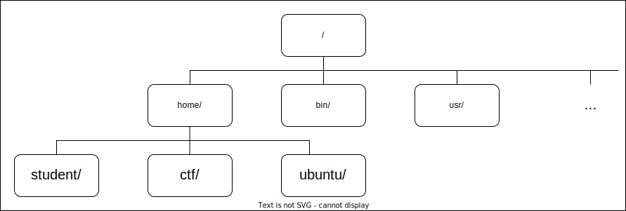

# Welcome to Linux

## Introduction

In this session, we will familiarise ourselves with our working environment.
We will learn how to set up a Kali Linux virtual machine and how to use its capabilities.
We will also introduce the programming language that we'll use throughout all sessions: Python.

## Prerequisites

- Fluency in the English language
- Basic programming knowledge (you are able to develop and run basic programs using integers, strings, arrays)
- The ability to use and search the Internet
- Curiosity, thirst for knowledge
- Interest in cybersecurity

## What is Linux?

Well, [Linux](https://en.wikipedia.org/wiki/Linux) is family of operating systems (OS's).
One such OS is [Kali Linux](https://en.wikipedia.org/wiki/Kali_Linux), which is specially designed for security enthusiasts.
This means that Kali comes with a few hundred preinstalled apps that are useful for anywone working in or learning about security.
We'll be using some of these apps throughout this track.

## Setting up Your Kali Virtual Machine

1. Start downloading the [Kali VM Image](https://security.cs.pub.ro/summer-school/wiki/_media/session/infrastructure/sss-kali-amd64.ova.torrent) torrent.
2. Download the VirtualBox installer for your system from [here](https://www.virtualbox.org/wiki/Downloads).
3. Install VirtualBox using the installer you downloaded at step 2.
4. Start VirtualBox.
5. When the download started at step 1 finishes, press the **Import** button.
6. Select the downloaded `.ova` file (the VM image) in the newly opened window.
7. Click **Import**.
You'll be able to change the VM's resources later.
After the import finishes, the VM should appear to the left of the VirtualBox window
8. Click the VM and then click **Start**.
9. Use the username `root` and the password `toor` to log in.

## Working with Linux

### I Command Thee

The most important shortcut when using a Linux operating system is `Ctrl + Alt + t`.
Try it now!
The dark box that has appeared is called a **terminal**.
A terminal is a means by which we can tell the operating system what to do for us.
In other words, we use the terminal in order to give **commands** to the operating system using a text interface, without the use of a mouse or fancy graphics.
Hence the terminal's alternative name: the **Command Line Interface (CLI)**.
What you've been using until now, namely navigating the desktop environment by clicking on shortcuts, files and links is called the **Graphical User Interface (GUI)**.

Here are a few useful key shortcuts for navigating the terminal more easily:
- open another terminal window: `Shift + Alt + t`;
- navigate between open terminal windows: `Alt + N`, where `N` is the index of the tab you want to switch to **(starting from 1)**;
- close the current window: `Ctrl + d`;
- copy text from the terminal: `Ctrl + Shift + c`;
- paste text to the terminal: `Ctrl + Shift + v`.

It's kind of like a web browser, if you think about it, but with different key combinations.
Don't worry about memorising them now, though.
You'll get plenty of time to practice them in today's activities and in the sessions to come.
For more terminal shortcuts, see the section [More Terminal Shortcuts](#more-terminal-shortcuts) below.

#### The Prompt

Note that the line begins with `root@kali:~#`.
This is what is called a **prompt**.
It's like a sign that the current terminal is waiting for commands to execute.

The format of the prompt is the following:
```
user@host_name: current_working_directory #
```
Now let's look at each of these components one by one.

- `user` is the name of the current user.
In our case, it says `root`.
We'll see what this means in its dedicated [section](#the-root-user) below.
We chan check that the user truly is `root` using the command `whoami`:
```
root@kali:~# whoami
root
```
- `host_name` is the name of the current system.
Once again, we can check if `kali` truly is our hostname by running the command `hostname`
```
root@kali:~# hostname
kali
```
- `#` is a sign that tells us that the prompt is over and that you can start typing commands.
It can also be `$` or `>`.
- `current_working_directory` is the **path** in the file system where we are currently located.
If this sounds confusing, don't worry.
We'll explain the file hierarchy right now.

#### The File System

One of the most important things when we're using the CLI and after hacking a remote system is to know where we are in its file hierarchy.
This hierarchy is more commonly known as the **file system**.
The path separator in Linux is `/`, unlike Windows, where it's `\`.
At the same time, `/` is the root of the file system. 

The file hierarchy looks like this:



Going back to the `current_working_directory` in the prompt, the terminal can also be seen as a file walker.
This means that at each moment it is "placed" in a certain directory, i.e. at some point in the file hierarcy.
We can see that the prompt shows `~`. This stands for **the home directory of the current user**.
Our current user is `root` and its home directory is `/root`.
Let's check this by running the command `pwd` (print working directory):
```
root@kali:~# pwd
/root
```

#### Traversing the File System

Great!
So now we know **where** we are in the file system.
Let's see what's here in `/root`.
For this, we use `ls`, that simply lists the contents of the current directory:
```
root@kali:~# ls
Desktop    ghidra_9.1.2_PUBLIC  peda      %SystemDrive%
Documents  libc-database        Pictures  Templates
Downloads  Music                Public    Videos
```

That's quite a bit of stuff, but there's no need to look into each of these now.
Let's focus on navigating the file system for now.

Almost every linux command, such as `ls`, can take various parameters that alter its behaviour.
`ls` for instance can list any given directory, not just the current directory.
This reqiures the use of the path to list as a parameter:
```
root@kali:~# ls /  # list the contents of the / (root) directory
0     dev   initrd.img      lib32   lost+found  proc  sbin  tmp  vmlinuz
bin   etc   initrd.img.old  lib64   media       root  srv   usr  vmlinuz.old
boot  home  lib             libx32  opt         run   sys   var
root@kali:~# ls /media  # list the contents of the /media directory
cdrom  cdrom0
```
Notice the second `#` symbol in each command.
This one is different from the one in the prompt.
It marks the beginning of a comment, just like `//` does in C.

So we can now see what a given directory contains, but we're still stuck in `/root`.
Let's change our current directory. For this, we use `cd`:
```
root@kali:~# ls libc-database/  # list the contents of libc-database
add  common  db  dump  find  get  identify  README.md  tmp
root@kali:~# cd libc-database/  # move to libc-database
root@kali:~/libc-database# ls  # list the contetns of the current directory (now libc-database)
add  common  db  dump  find  get  identify  README.md  tmp
root@kali:~/libc-database# pwd  # check that we really are in libc-database
/root/libc-database
```
Notice the prompt change to `~/libc-database` after `cd` because the current directory changes.

Stop!
**`Tab` Time!**
Almost every CLI is capable of autocompletion and that of Linux is no different.
Type `cd l` and then press `Tab`.
Notice that the rest of the directory's name has been autofilled: `cd libc-database/`.
Now type `cd D` and press `Tab` **twice**.
Notice that 3 options have appeared.
What happened is that the terminal found 3 directories that start with `D` and is asking you for more information.
Type `e` and press `Tab` once more.
Now the terminal sees there is only one option, `Desktop/` and autofills it for you.

`Tab` allows you to use the terminal very efficiently.
It's one of the most powerful tools at our disposal, so remember to abuse it as much as possible.
**Keep in mind: there is no such thing as pressing `Tab` too many times**.

Now back to our directories.
So we're in `libc-database`, but how do we get back to `/root`?
Similarly to a browser, the parent of any directory can be accessed using `..` like so:
```
root@kali:~/libc-database# ls ..
Desktop    ghidra_9.1.2_PUBLIC  peda      %SystemDrive%
Documents  libc-database        Pictures  Templates
Downloads  Music                Public    Videos
root@kali:~/libc-database# cd ..
root@kali:~# ls
Desktop    ghidra_9.1.2_PUBLIC  peda      %SystemDrive%
Documents  libc-database        Pictures  Templates
Downloads  Music                Public    Videos
root@kali:~# pwd
/root
```
Makes sense? Alright. So now we can move anywhere.
We can chain paths using the separator (`/`), even adding `..`, like so:
```
root@kali:~/libc-database# cd ../..  # we are in /root/libc-database
root@kali:/# ls  # now we are 2 levels up, in /
0     dev   initrd.img      lib32   lost+found  proc  sbin  tmp  vmlinuz
bin   etc   initrd.img.old  lib64   media       root  srv   usr  vmlinuz.old
boot  home  lib             libx32  opt         run   sys   var
```

#### Be a Man!

Almost every Linux command comes with extensive documentation.
This documentation can be read using `man <command>`.
Let's try reading the manual page for the `ls` command:
```
root@kali:~# man ls
```

- Use `↑` and `↓` to scroll up and down.
- Use `Space` to scroll one whole page down.
- Use `/<string>` to search for any string.
Try searching for the string "recursive".
Use `n` to navigate to the next occurrence of your string and `Shfit + n` to navigate to the previous one.
- Use `q` to quit the manual

**Task 1:** Use the parameter you've just found to recurisively list the contents of the `/root/libc-database` directory, using both relative and absolute paths.

**Task 2:** Use the man page for `ls` again to learn how to view the contents of a directory in the form of a **long listing**.
This parameter will show you more details regarding a file, such as its type, size, owner, access rights, the date when it was last modified etc.
Test it on the file `/root/libc-database/README.md`

**Task 3:** Use the man page for `ls` to find out what parameter to pass to `ls` to list **all** entries in a directory.
This option will also show you the **hidden** files in that directory.
These files start with `.`.
Test it on the `~` directory.
Notice our friend `..` is also present.

#### I'll Make My Own Hierarchy!

In order to create directories we use the `mkdir` command:
```
root@kali:~# mkdir demo
root@kali:~# ls
demo     Documents  ghidra_9.1.2_PUBLIC  Music  Pictures  %SystemDrive%  Videos
Desktop  Downloads  libc-database        peda   Public    Templates
root@kali:~# cd demo
root@kali:~/demo# 
```

Now let's create a file in our new directory.
For this, we use the `touch` command.
It creates an **empty** file.
```
root@kali:~/demo# touch demo-file
root@kali:~/demo# ls
demo-file
root@kali:~/demo# cat demo-file  # The file is empty, so nothing is printed.
root@kali:~/demo# touch demo-file2  # Just because we can.
root@kali:~/demo# ls
demo-file  demo-file2
```

In order to remove a file, we use the `rm` command.
```
root@kali:~/demo# rm demo-file2
root@kali:~/demo# ls
demo-file
```

Now let's try to remove our directory the same way.
```
root@kali:~# rm demo
rm: cannot remove 'demo': Is a directory
```
Deleting a directory requires that an extra parameter be passed to `rm`.
Find it in `rm`'s `man` page.
Look for the string "recursively".
Yup, it's `-r` (or `-R`, or `--recursive`; all three work).
```
root@kali:~# rm -r demo/
root@kali:~# ls
Desktop    ghidra_9.1.2_PUBLIC  peda      %SystemDrive%
Documents  libc-database        Pictures  Templates
Downloads  Music                Public    Videos
```

All clean!

#### Absolute or Relative?

There are two ways of expressing a file path: relative and absolute.
**Relative** paths are called so because they refer to the current directoy.
```
root@kali:~# cd libc-database/
```
This command  uses a **relative** path, as `libc-database` only exists in `/root` (`~`).
If we were to run it from `/bin` for instance, it wouldn't work because there is no `libc-datbase` directory in `/bin`.

**Absolute** paths however can be used from anywhere in the filesystem.
They contain the full path to the file, starting from the root of the file system (`/`):
```
root@kali:/lib/x86_64-linux-gnu/security# cd /root/libc-database/
root@kali:~/libc-database# pwd
/root/libc-database
```
In the snippet above, we were able to navigate to `/root/libc-database` from somewhere completely different in the hierarchy.

Let's get some practice:
- Navigate to `/usr/lib/dpkg/methods/apt/`, but don't just copy and paste this path.
Use `Tab` and you'll barely have to type anything.
- Now get back to `root`'s home using the home directory shortcut.
- Navigate to `~/ghidra_9.1.2_PUBLIC/docs/images` using its absolute path.
- Now move 2 levels up the hierarchy without retyping the path.
Use `..`.

#### Inspecting File Contents

Up to this point, we've learned how to traverse the file system.
Now we need to be able to *inspect* the files themselves.
The simplest ways to view the contents of a file in the terminal is the `cat` command:
```
root@kali:~# cat /etc/hostname 
kali
```
As you've probably guessed, `/etc/hostname` is the file where the machine's host name is stored.

Feel free to consult `cat`'s man page for further details about the command.
We'll introduce more advanced means of outputting the contents of a file in the session dedicated to [Data Representation](../data-representation).
Stay tuned!

### The Root User

As we said previously, the prompt may indicate the current user, in our case `root`.
But what exactly is this user?
Well, Linux systems admit multiple levels of user privileges.
These privileges refer to the actions a certain user is allowed to perform, such as installing other apps or reading various files.

But among all users, there is *one to rule them all*: `root`.
Similar to the `Administrator` user in Windows, `root` has no restrictions to the actions he may perform.
This is the default user in Kali Linux, so you don't need to worry about permissions.
However, when logging into the remote servers we provide for some of the CTF challenges below, the user will be `ctf` and it **does** have limited permissions.

### Processes

Now that we've learned how to use the terminal, let's take a look at the desktop.
A few common apps are pinned to the left taskbar.
Any application that is installed on a system is called a **program**.
One such program is the web browser **Firefox**
By clicking the Firefox icon, the **program** starts to run.
Any running program is called a **process**.

Let's test this by learning a new command.
With Firefox closed, run the command `ps`.
Use `man` to learn what it does.
If you use it as-is in the terminal, it displays two running processes: `bash` and `ps` itself:
```
root@kali:~# ps
    PID TTY          TIME CMD
   1929 pts/0    00:00:00 bash
   3304 pts/0    00:00:00 ps
```
- `bash` stands for *Bourne-Again Shell* and is the command interpreter used by the terminal.
In other words, it's what reads your input and executes the commands you type.
- You already know what `ps` is.
But why is it here? You see, in order for `ps` to start scanning for what processes are running, it needs to be running itself, which means it's inevitable that it finds itself while scanning.

Now open Firefox from the side bar and run `ps` again:
```
root@kali:~# ps
    PID TTY          TIME CMD
   1929 pts/0    00:00:00 bash
   3304 pts/0    00:00:00 ps
```
Where is Firefox?
Well, when run without parameters, `ps` displays the processes that are running **inside the current terminal**, i.e. that have been started from this terminal.
Firefox was started from the GUI, so it has nothing to do with our terminal.
Use `man` to learn how to list the **full** output of **all** processes in the system.

Hopefully you haven't cheated and did find the `-A` (or `-e`) and `-f` options yourself.
Now the output is rather huge, but we only care about the final lines:
```
root@kali:~# ps -A -f
[...]
root        3367    1612 50 15:54 ?        00:00:01 /usr/lib/firefox-esr/firefox-esr
root        3444    3367 20 15:54 ?        00:00:00 /usr/lib/firefox-esr/firefox-esr -contentproc -childID 1 -isForBrowser -prefsLen 1 -prefMapSize 183434 -parentBuildID 20200527211442 -greomni /usr/lib/firefox-esr/omni.ja -appomni /usr/l
root        3498    3367 14 15:54 ?        00:00:00 /usr/lib/firefox-esr/firefox-esr -contentproc -childID 2 -isForBrowser -prefsLen 5670 -prefMapSize 183434 -parentBuildID 20200527211442 -greomni /usr/lib/firefox-esr/omni.ja -appomni /us
root        3549    3367 35 15:54 ?        00:00:00 /usr/lib/firefox-esr/firefox-esr -contentproc -childID 3 -isForBrowser -prefsLen 6402 -prefMapSize 183434 -parentBuildID 20200527211442 -greomni /usr/lib/firefox-esr/omni.ja -appomni /us
root        3590    3367 10 15:54 ?        00:00:00 /usr/lib/firefox-esr/firefox-esr -contentproc -childID 4 -isForBrowser -prefsLen 6402 -prefMapSize 183434 -parentBuildID 20200527211442 -greomni /usr/lib/firefox-esr/omni.ja -appomni /us
root        3623    1929  0 15:54 pts/0    00:00:00 ps -A -f
```
Great success!
We have seen Firefox move from being a simple program to being a running process.
In addition, we've learned a new command that is useful for inspecting what processes might be running on a system.
Once you hack into a remote system, you can use `ps` to inspect what potentially exploitable processes are there.

### Scripts

It is often convenient to group together a set of instrucitons so that you don't have to type them separately each time you want to make use of their combined functionality.
For this purpose, you can use Bash scripts.
They are text files that simply contain Bash commands.
Bash is also a programming lanugage that comes with `if` statements, `for` loops, functions and more, but we won't be needing those right now.

Bash scripts typically bear the extension `.sh`, but this is by no means mandatory.
Take some time to take a look at and run the Bash script in `activities/demo-bash/demo.sh`.
You can run it like so:
```
root@kali:~/essentials/welcome-to-linux/activities/demo-bash# sh demo.sh
```

## Enter Python

### The Basics

Python is a programming language designed with simplicty in mind.
It's meant to be simple and fast to read, understand and write.
This is evident even from the language's syntax.

To get accustomed to Python, take a look at the code in the `activities/demo-python` dierctory.
Feel free to fiddle with any of the code snippets.
Add your own, try things out and experiment!

In order to run a Python script, just type the name of the script preceeded by `python3`:
```
root@kali:~/essentials/welcome-to-linux/activities/demo-python# python3 variables.py
```

#### Variables

Let's start with [variables.py](./activities/demo-python/variables.py).
This file explains how variables such as integers, floats and strings work in Python.
It also introduces the `print` function.
Inspect and run the code.
Note that, unlike C code, in Python there is no need for a `;` at the end of each line.

#### If Statements

Now that we know how to create and print variables, let's learn some more of the language's syntax, starting with the `if` keyword.
A typical `if` statement looks like this:
```python
if condition:
    # run some code
```
Notice that there are no `{}`, like you would use in C.
This is because Python relies on **indentation** to determine which instructions make up the body of the `if` statement and which don't.
Moreover, a colon (`:`) needs to be used after every `if`, `for` or function declaration, as we'll see shortly.
To make things clearer, check out and run the code in `activities/demo-python/if.py`.

As stated above, this code would not work because the `print` instruction is not correctly indented and the `if` statement appears to have no body:
```python
if a == 0:
    print('This is an incorrect if statement. You will get an IndentationError.')
```
But don't take our word for granted.
Run this code too!

#### Loops

Loops, be they `for` or `while` loops, use the same syntax as `if` statements:
```python
for var in set_of_objects:
    # for body

while condition:
    # while body
```
Once again, note the usage of the `:` after each loop declaration and the indentation of their bodies.

The `in` keyword present in the `for` loop above signifies that the `var` variable will act as an **iterator**.
At every step of the loop, `var` will be assigned to each consecutive element of  the collection `set_of_objects`.

As before, take a look at, run and play with the code in `activities/01-demo-python/loops.py` until you feel you get the hang of `for`s and `while`s.

#### Functions

You've already seen the `print`, `range` and `reversed` functions.
It is natural that we now try to create our own functions.
They follow the same syntax as before:
```python
# As expected, the types of the parameters need not be specified.
# But you can do it if you want/need to.
def func(param1, param2):
    # function body
```

We can also specify a **default** value that a parameter can take when none is specified:
```python
def foo(param1, param2=5):  # param2 defaults to 5 when not specified
    # function body

# Both of these function calls are correct
foo('whatever')  # Here param2 = 5, by default
foo('whatever', 2)
```
By now, you already know what to do.
The demo for Python functions is in `activities/demo-python/functions.py`.
Go to town on it!

### Data Structures

Python comes equipped with builtin data structures, such as lists and dictionaries.

#### Lists

Lists are indexed arrays that can store any type of data.
You can create a list by specifying its elements enclosed in `[]`:
```python
lst = [1, 'some string', True, 2.9]
```
Accessing the lists elements is similar to C: `lst[0]`, `lst[1]` and so on.
Yes, lists in Python are indexed from 0.

Now go ahead and get some practice with lists by using the `activities/demo-python/lists.py` script.

#### Dictionaries

Conceptually, dictionaries are mappings between a set of **keys** and a set of **values**.
This means that **each key** is associated to **one value**.
The opposite does not always hold true. 
Thus, each **key** in a dictionary is unique, but there is no such rule for **values**.

Let's construct a dictionary and see what it does:
```python
my_dict = {
    "SSS": "Rullz",
    "Essentials": 10,
    True: 0.2,
    2.2: 99
}
```
As you can see, neither the keys, nor the values in a dictionary need to be of the same type.

In order to access the value associated to a key, the syntax is the following:
```python
print(my_dict['SSS'])  # Will print "Rullz"
```

### Working with Files

Reading input from and writing output to is essential for any programmer.
We'll make heavy use of this feature in the future.

The main function for interacting with files is `open`.
Its simplified signature is the following:
```python
def open(filename, mode='rt'):
```
The `filename` parameter is self-evident.
The `mode` however, answers the question: "What do you want to do with this file?"
The `mode` parameter is a string, where each character has its own meaning.
The list of the most common characters is specified in [Python's official documentation](https://docs.python.org/3/library/functions.html#open).

Use https://docs.python.org whenever you need to look up some of Python's features.
For a quick intro into handling files in Python, consult the `activities/demo-python/files.py` script.
Run it, and then check the contents of the `output.txt` file it creates.

#### Strings or Bytes?

In the previous section, we saw how we can read **strings** from and write them to files.
However, the more frequent way of interacting with files is by using **byte arrays**.

**Byte arrays** are very similar to strings, supporting nearly the same operations, but differ in representation.
While strings can also encode non-ASCII characters, such as `ä`, or even emoji, bytes are restricted to ASCII characters.
For this reason, one letter in a byte array is exactly one byte in size, whereas a letter in a string could use more space, depending on its encoding.
As a result, the main reason they exist is to process data, regardless of encoding.
Network packet data, binary file contents, images are all to be processed as bytes, not as strings.

You can create a byte array just like you would create a regular string **and adding a `b` in front**, like this:
```python
my_bytes = b'SSS Rulz, but in bytes!'
```

As always, the demo `activities/demo-python/strings_bytes.py` provides a more in-depth presentation of byte array and string operations.
Go take a look.

## Summary

### Linux

A quick rundown of the most important Linux commands from today's session is:
- `ls`: list the current directory;
- `cd <direcory>`: move to the specified directory;
- `mkdir` creates a new directory;
- `touch` creates a new file;
- `rm` deletes files and directories;
- `whoami`: prints the current user;
- `pwd`: prints the absolute path to the current directory;
- `cat`: output the contents of a file;
- `Tab`: your best friend in the whole world;
- `man <command>`: the source of infinite wisdom.

### Python

Some concepts to remember about Python are:
- There is no need for a `main` function or for types;
- Indentation is everything
- Basic arithmetic is almost the same as in C/C++;
- `if`s, `for`s, `while`s and function declarations all end in a colon (`:`);
- There's a difference between bytes and strings and they are **not** interchangeable.

## Activities

Security Summer School most activities take the shape of **CTF challenges**.
CTF stands for "Capture The Flag" and is a type of challenge where you are given access to an environment (a set of files, a website, a remote system etc.), which you have to use in order to obtain and submit a special string called **flag**.
We use the [CyberEdu platform](https://sss-essentials.cyberedu.ro/) for submitting flags.
Each challenge name uses the format `Essentials: Session Name: Challenge Name`.
Do the challenges for today's session: `Welcome to Linux`.
For the Security Summer School, all flags follow this pattern:
```
SSS{some_random_ASCII_characters}
```

### Tutorial: In Your Face

The flag is literally in your face.

Connect to the specified virtual machine and use `ls` to explore your surroundings:
```
ctf@tutorial:~$ ls
flag
```
Now just use `cat` to extract the content of the `flag` file.

### Challenge: Did You Look Everywhere?

We assure you the flag is somewhere in the `/home/ctf` directory.

### Challenge: What's Running?

Did you know flags can **run**?

### Challenge: Quick Mafs

The flag's format is the classic `SSS{...}`, where `...` represent a string obtained by concatenating the **first 10 numbers** oobtained by performing the computations below.

Let each number be `n[i]`, where `i` is its index.
`n[0] = 1337`.
This is your first number.
The next numbers are defined by the formula below, where `^` signifies exponentiation.
```
n[i] = (n[i - 1]^3 * 67 + 31) % 2000, for all i > 0
```
And, please, don't compute the numbers manually.
You've just learned a cool new programming language that you can use!

### Challenge: Jumbled

The flag you're given in `activities/jumbled/public/flag` does contain the actual flag, but not quite.
Use your Python skills to reconstruct it.
You'll also need some trial and error here.

## Further Reading

### More Terminal Tricks

- Use `↑` and `↓` to navigate between your previous commands.
- Use `Ctrl + r` to search for a previously issued command.
- Use `Ctrl + A` to navigate to the beginning of the line.
- Use `Ctrl + E` to navigate to the end of the line.
- Use `Alt + B` to navigate one word to the left of the cursor.
- Use `Alt + F` to navigate one word to the right of the cursor.
- Use `Alt + Backspace` to delete one word to the left of the cursor.
- Use `Ctrl + Delete` to delete one word to the right of the cursor.
- Use `Ctrl + D` to close the current terminal.

### Altering the Prompt

You can modify your prompt while keeping the same user and host name, by using the `PS1` **environment variable**.
Check out how you can do this [here](https://www.redhat.com/sysadmin/command-prompt-tell-me).

### Alternatives to Bash

There are quite a few alternatives to Bash, such as [zsh](https://ohmyz.sh/) and [DASH](http://manpages.ubuntu.com/manpages/trusty/man1/dash.1.html).
Feel free to experiment with them in your free time.

### Hardcore Python

Python is well-known for being able to produce short code.
A part of this feature owes to its [list comprehensions](https://www.datacamp.com/community/tutorials/python-list-comprehension?utm_source=adwords_ppc&utm_campaignid=1455363063&utm_adgroupid=65083631748&utm_device=c&utm_keyword=&utm_matchtype=b&utm_network=g&utm_adpostion=&utm_creative=278443377095&utm_targetid=aud-392016246653:dsa-486527602543&utm_loc_interest_ms=&utm_loc_physical_ms=1011795&gclid=CjwKCAjw64eJBhAGEiwABr9o2NXKuiirYa09rYT-hLIh7th5Exg3vj9YPnpAT7EszhE539X_9guv1RoCvhIQAvD_BwE) and its [`join` function](https://www.geeksforgeeks.org/python-string-join-method/).

If you want to learn even more, take a look at Python's [builtin list operations](https://docs.python.org/3/howto/functional.html#built-in-functions):
Learning about [lambda functions](https://towardsdatascience.com/lambda-functions-with-practical-examples-in-python-45934f3653a8) will surely ease your use of the above functions.
